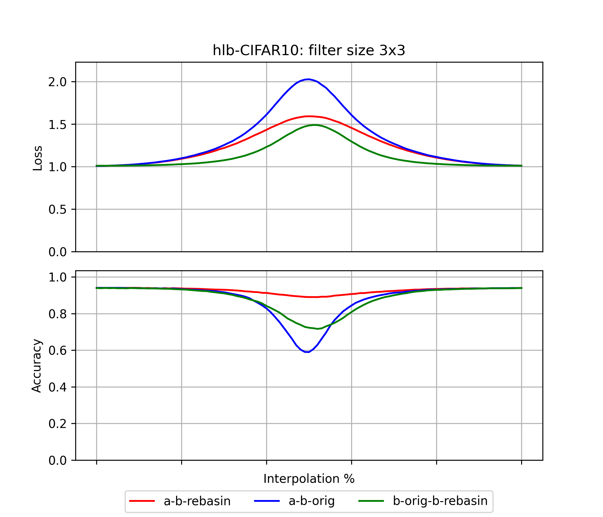
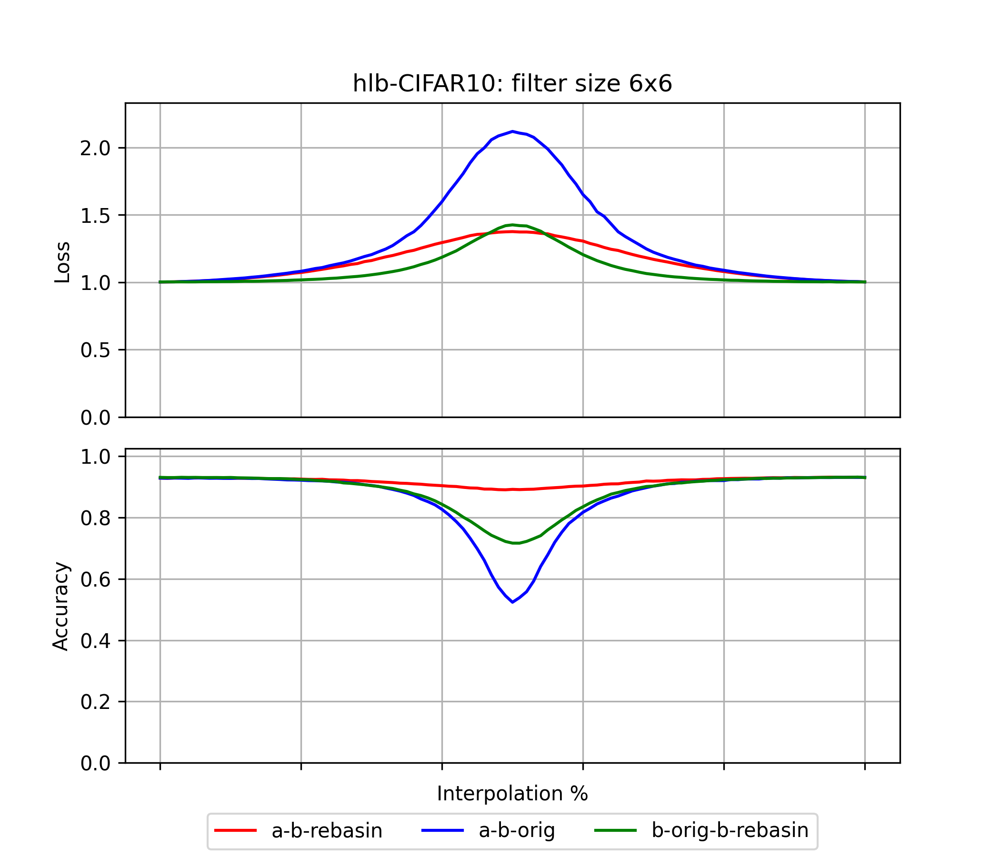
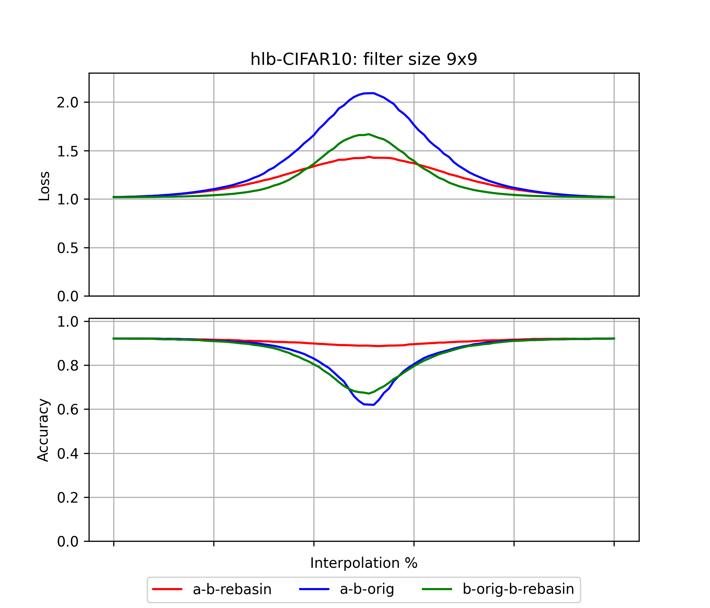
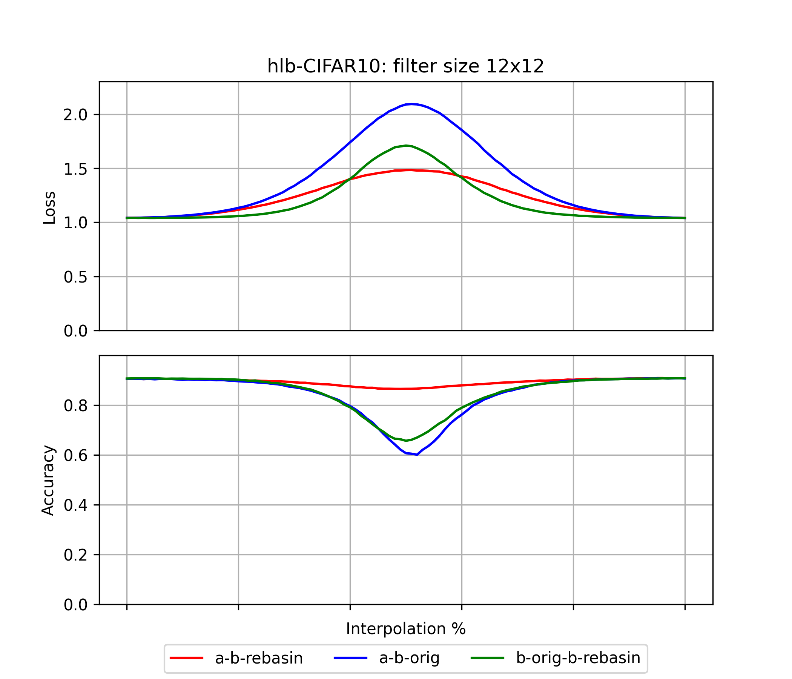

# hlb-CIFAR10: Git re-basin results

These are the from forking [tysam-code/hlb-CIFAR10](https://github.com/tysam-code/hlb-CIFAR10).
See [snimu/hlb-CIFAR10](https://github.com/snimu/hlb-CIFAR10) for the fork.

Below are first the losses and accuracies plotted for the model, then a graph of the model itself
(generated using [torchview](https://github.com/mert-kurttutan/torchview)).

## Results

The first plot shows the results
for the original model, while the others show results for ever-increasing filter-sizes of the 
convolutions. 
It is mentioned in the paper that the results are better for larger filter-sizes.

### Filter-size: 3x3

The original filter size.

    

### Filter-size: 6x6

    

### Filter-size:9x9

    

### Filter-size: 12x12

    

### Filter-size: 15x15

    

### Analysis

A few things immediately jump out to me from the plots above:

1. The mothod works somewhat; interpolation between `model_a` and `model_b (rebasin)`
    is much better than between `model_a` and `model_b (original)`.
2. Applying the method to `model_b` and then interpolating between 
     `model_b (original)` and `model_b (rebasin)` yields better results than
     interpolating between `model_a` and `model_b (original)`. 
     This is not fully unexpected, because these two are of course fairly
     close to each other, but it's also not obvious (at least not to me).
3. The git re-basin method works very well for the accuracy of the model!
     At least for this model, interpolation between `model_a` and `model_b (rebasin)`
     leads to almost flat accuracies. 
4. Larger filter size is said to work better in the paper, 
    and actually do work slightly better. It should be noted, however, that 
    increasing the filter size significantly increases the number of parameters,
    and thus the compute it takes to train the model, without increasing
    accuracy or decreasing the loss (in fact, it slightly worsens the results, 
    though that may just be because the hyperparameters were not adapted to the 
    changed model at all).

## Model

The model is a simple Resnet:

    

