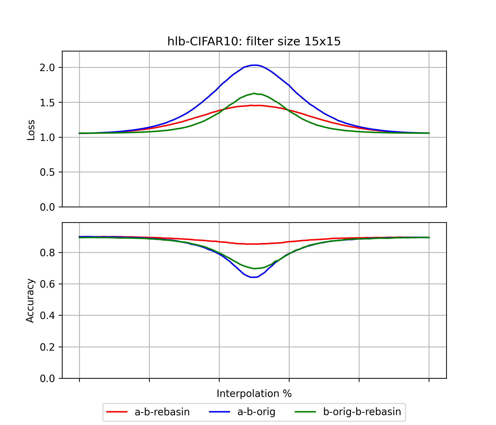

# hlb-CIFAR10: Git re-basin results

These are the results from forking [tysam-code/hlb-CIFAR10](https://github.com/tysam-code/hlb-CIFAR10).
See [snimu/hlb-CIFAR10](https://github.com/snimu/hlb-CIFAR10) for the fork.

Below are first the losses and accuracies plotted for the model, then a graph of the model itself
(generated using [torchview](https://github.com/mert-kurttutan/torchview)).

## Results

The first plot shows the results
for the original model, while the others show results for ever-increasing filter-sizes of the 
convolutions. 
It is mentioned in the paper that the results are better for larger filter-sizes.

### Filter-size: 3x3

The original filter size.

    

### Filter-size: 6x6

    

### Filter-size:9x9

    

### Filter-size: 12x12

    

### Filter-size: 15x15

    

### Analysis

A few things immediately jump out to me from the plots above:

1. The method works somewhat; interpolation between `model_a` and `model_b (rebasin)`
    is much better than between `model_a` and `model_b (original)`.
2. Applying the method to `model_b` and then interpolating between 
     `model_b (original)` and `model_b (rebasin)` yields better results than
     interpolating between `model_a` and `model_b (original)`. 
     This is not fully unexpected, because these two are of course fairly
     close to each other, but it's also not obvious (at least not to me).
3. The git re-basin method works very well for the accuracy of the model!
     At least for this model, interpolation between `model_a` and `model_b (rebasin)`
     leads to almost flat accuracies. 
4. Larger filter size is said to work better in the paper, 
    but it is unclear to me if this is actually the case here. Let's look at that 
    in more detail below.

#### Filter-size analysis

Below, I plot the losses and accuracies 
when interpolating between `model_a` and `model_b (rebasin)`.

I do so for all filter-sizes.

    

    

It is not clear to me that larger filter sizes lead to better results. 
However, larger filter-sizes do degrade model-performance in general, 
so to give a comparison of how rebasin affects how interpolation between models
behaves, I plot the losses and accuracies again below, but this time 
I move all startpoints (i.e. `model_a`) to the results of the 3x3-filter.

    

    

The behavior seems noisy, though slightly better for larger filter-sizes.

## Model

The model is a simple Resnet:

    

