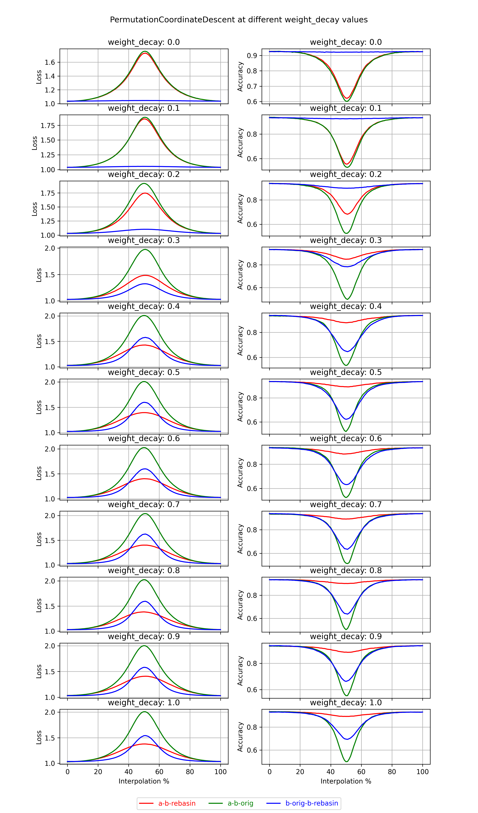

# hlb-CIFAR10: Git re-basin results

These are the results from forking [tysam-code/hlb-CIFAR10](https://github.com/tysam-code/hlb-CIFAR10).
See [snimu/hlb-CIFAR10](https://github.com/snimu/hlb-CIFAR10) for the fork.

Below are first the losses and accuracies plotted for the model, then a graph of the model itself
(generated using [torchview](https://github.com/mert-kurttutan/torchview)).


## Results

I have results for two algorithms: 

1. `PermutationCoordinateDescent`
2. `MergeMany`

**Table of Contents:**

- [PermutationCoordinateDescent](#permutationcoordinatedescent)
  - [By filter-size](#by-filter-size)
    - [Filter-size: Analysis](#filter-size-analysis)
  - [By L2-Regularizer](#by-l2-regularizer)
    - [L2-Regularizer: Analysis](#l2-regularizer-analysis)
- [MergeMany](#mergemany)
  - [Simple MergeMany](#simple-mergemany)
  - [Train-Merge-Train](#train-merge-train)
  - [Train on different datasets](#train-on-different-datasets)
- [Model](#model)
- [Permutations](#permutations)

### PermutationCoordinateDescent

I'll test `PermutationCoordinateDescent` over two parameters: 

1. **Filter-size:** According to the paper, larger filter-sizes work better.
    I'll test filter-sizes of 3x3, 6x6, 9x9, 12x12, 15x15, and 18x18.
2. **L2-Regularizer:** This isn't part of the paper, but it makes sense to me 
   that an algorithm that works by permuting weights to be as similar as possible
   to that of another model would benefit from all weights being in the same value-range.
   I'll use the `weight_decay`-parameter of `torch.optim.Adam` to regularize the weights.
   Values will range from `0.0` to `0.9`


#### By filter-size

This is at a fixed `weight_decay > 0.0`. 

<p align="center">
    
</p>

##### Filter-size: Analysis

A few things immediately jump out to me from the plots above:

1. The method works somewhat; interpolation between `model_a` and `model_b (rebasin)`
    is much better than between `model_a` and `model_b (original)`.
2. Applying the method to `model_b` and then interpolating between 
     `model_b (original)` and `model_b (rebasin)` yields better results than
     interpolating between `model_a` and `model_b (original)`.
3. The git re-basin method works very well for the accuracy of the model!
     At least for this model, interpolation between `model_a` and `model_b (rebasin)`
     leads to almost flat accuracies. 
4. Larger filter size is said to work better in the paper, 
    but it is unclear to me if this is actually the case here. Let's look at that 
    in more detail below.

Below, I plot the losses and accuracies 
when interpolating between `model_a` and `model_b (rebasin)`.

I do so for all filter-sizes.

<p align="center">
    
</p>

<p align="center">
    
</p>

It is not clear to me that larger filter sizes lead to better results. 
However, larger filter-sizes do degrade model-performance in general
(the larger the filter size, the worse the performance of the first and last model,
which are the original `model_a` and `model_b (rebasin)`), 
so to give a comparison of how rebasin affects how interpolation between models
behaves, I plot the losses and accuracies again below, but this time 
I move all startpoints (i.e. `model_a`) to the results of the 3x3-filter.

<p align="center">
    
</p>

<p align="center">
    
</p>

The behavior seems noisy, though slightly better for larger filter-sizes.


#### By L2-Regularizer

This is at a fixed `filter_size == 28*28 == 784`.

<p align="center">
    
</p>

##### L2-Regularizer: Analysis
    
These results are *very* weird. 

As expected, increasing the L2-Regularizer 
improves the results of `PermutationCoordinateDescent` significantly;
in fact, the algorithm only really works for pretty high `weight_decay`-values,
where it doesn't fully remove the loss-barrier, but lowers it by a lot, 
and almost fully removes the accuracy-barrier (this stands in opposition to the results
of the paper, where `PermutationCoordinateDescent` removed the loss-barrier but not 
the accuracy-barrier).

However, I cannot explain the behavior of the interpolation between 
`model_b (original)` and `model_b (rebasin)`. At low `weight_decay`-values,
it is extremely good, much better than that between `model_a` and `model_b (rebasin)`.

The first possible explanation for this might be that `model_b (original) === model_b (rebasin)`.
In other words, `model_b (original)` was already optimally aligned with `model_a`,
such that it didn't get permuted.
However, this is clearly not the case, as these facts about the interpolation
as `weight_decay == 0.0` show:

1. The accuracies between `model_b (original)` and `model_b (rebasin)` change
   from step to step, which means that the interpolated models are different from
   either of the two models, which in turn means that the two models are different.
2. The interpolation between `model_a` and `model_b (original)` is different 
   from that between `model_a` and `model_b (rebasin)`, which means that
   `model_b (original) != model_b (rebasin)`.

An alternative explanation might be that 
a high regularization lead to `model_b (original)` being in a narrower loss-basin, 
such that permuting it and interpolating between the results leads to poor results.
This might explain why the absolute accuracy falls with rising `weight_decay` 
(at least when going from `0.0` to `0.1`). However, that fact may also be explained 
by the fact that the model wasn't tuned for any of the given `weight_decay`-values,
and that the differences in accuracy are just random.

The explanation that seems the most likely to me is that at low `weight_decay`-values,
only one or two weights are permuted, leading to good interpolation between
`model_b (original)` and `model_b (rebasin)`, but barely any difference 
between the interpolations betwen `model_a` and `model_b (original)` & `model_b (rebasin)`.

Ultimately, though, I don't know.


### MergeMany

I also implemented the `MergeMany`-algorithm from the paper. 
Here are the results of running tests with it on `hlb-CIFAR10`.

I ran three kinds of tests:

1. [Simple `MergeMany`](#simple-mergemany). Doesn't seem to work well.
2. [Train-Merge-Train](#train-merge-train). Use `MergeMany` as pre-training / initialization, 
    then train the model further. Doesn't seem to work well.
3. [Train on different datasets](#train-on-different-datasets).
    Train models on different datasets, then merge them and retrain on one last dataset.
    **This seems to work well!**

#### Simple MergeMany

I used the `MergeMany`-algorithm with the following convolutional kernel-sizes:

- 3x3
- 6x6
- 9x9

I used all of these once when merging 3, 6, 9, and 12 models.

Below are the losses and accuracies.

<p align="center">
    
</p>

<p align="center">
    
</p>

Clearly, `MergeMany` significantly reduces performance instead of improving it 
(as claimed in the paper). The more models are merged, the greater the loss in performance.

And to be clear, the more models are merged, the *worse* performance becomes.

In the paper, an MLP was used for merging, so that might be another interesting thing to try.

#### Train-Merge-Train

After the poor results seen above, I was wondering if training for a few steps after 
merging several models might yield better results than just training a single model
for the equivalent number of epochs (i.e. 10 epochs, if each of the merged models is trained
for 5 epochs and the merge model for another 5 epochs). If it were, 
then the `MergeMany`-algorithm may still be useful for federated learning.

I use the following training procedure:

- `n` models trained fo 5 epochs each, merged, then trained for another 5 epochs
- 1 model trained for 10 epochs (the control model)

I use the following abbreviations:

- `L`: Loss (of the merged & retrained model &mdash)
- `LC`: Loss control (of the control model)
- `A`: Accuracy (of the merged & retrained model)
- `AC`: Accuracy control (of the control model)

| Settings (#models --- filter-size) | L     | LC    | L/LC   | A     | AC    | A/AC  |
|------------------------------------|-------|-------|--------|-------|-------|-------|
| 3 --- 3x3                          | 1.064 | 1.030 | 103.3% | 0.914 | 0.932 | 98.1% |
| 3 --- 6x6                          | 1.053 | 1.018 | 103.4% | 0.906 | 0.924 | 98.1% |
| 3 --- 9x9                          | 1.079 | 1.046 | 103.2% | 0.889 | 0.904 | 98.3% |
| 6 --- 3x3                          | 1.077 | 1.034 | 104.2% | 0.907 | 0.929 | 97.6% |
| 6 --- 6x6                          | 1.069 | 1.018 | 105.0% | 0.897 | 0.923 | 97.2% |
| 6 --- 9x9                          | 1.087 | 1.042 | 104.3% | 0.879 | 0.906 | 97.0% |
| 9 --- 3x3                          | 1.103 | 1.032 | 106.9% | 0.895 | 0.931 | 96.1% |
| 9 --- 6x6                          | 1.078 | 1.022 | 105.5% | 0.893 | 0.921 | 97.0% |
| 9 --- 9x9                          | 1.113 | 1.041 | 106.9% | 0.872 | 0.909 | 95.9% |
| 12 --- 3x3                         | 1.111 | 1.032 | 107.7% | 0.890 | 0.929 | 95.8% | 
| 12 --- 6x6                         | 1.143 | 1.019 | 112.2% | 0.859 | 0.921 | 93.2% | 
| 12 --- 9x9                         | 1.135 | 1.045 | 108.6% | 0.858 | 0.905 | 94.8% |

The control model was always trained in exactly the same way, though with the same 
filter-size as the merged models. This means that the variance seen in the control model
for different numbers of losses at the same filter-size is due to the random initialization
of the model. However, clear trends are still visible.

It is clear that using `MergeMany` as a form of pre-training does not improve performance.
In fact, increasing the number of models that are merged decreases the performance of the merged model
(which is not surprising, given that merging is used as a form of pre-training here, 
and more models mean worse performance in the pre-trained model). 
Increasing the filter-size, on the other hand, doesn't affect the performance difference
between the merged model and the control model. 

In general, **`MergeMany` doesn't work for pre-training / initialization.**

However, if a few models were trained for 5 epochs in one location, merged, 
and then for another *10 epochs* at another location, 
that would likely improve performance compared to simply training for 10 epochs.
In other words, using distributed training with `MergeMany` will likely increase 
performance relative to simply training for a lower number of epochs in one location.

On the other hand, it seems like using more models for that is worse, not better,
and simply not merging before continuing the training would be even better. 
So even for this purpose, `MergeMany` doesn't seem to be useful 
(for the given architecture, at least).

### Train on different datasets

There is a caveat to the above: all of these models were trained on the same data.
Results might be different if the models were trained on different data each.

That means that `MergeMany` *might* still be useful for effectively increasing dataset-size
through federated learning. This is what I've tested next.

To do so, I split `CIFAR10` into `n+1` parts, where `n` is the number of models that I would merge.
I would train `n` models for `e` epochs, each on a different part of the dataset, 
then merge them. Then, I would train the merged model for another `e` epochs 
on the last part of the dataset.

For comparison, I would train a single model for `e` epochs on only the last part of the dataset.
This is to see whether the merged model performs better 
than a single model trained for the same number of epochs. 
This would already be useful, if local training of several models on private datasets 
followed by merging and retraining on a public dataset yields a better model than just
training on the public dataset with equivalent compute time.

I then continued training of that model for another `e` models, for a total of `n * e` epochs.
This is to see whether the merged model performs better than a single model 
given the same compute resources as the merged model including the "pre-training"
(a.k.a. training of models that were then merged).

In the [results](merge_many/train_different_datasets), `Model <i>` refers to the ith model
that was used for merging, `Merged Model` refers to the model that was obtained by merging
those models, and `Control Model (<j>)` to the control model trained on `j * e` epochs.

There are two different parameters of interest that may influence the results:

1. The number of epochs that each model is trained for (`e`).
2. The number of models that are merged (`n`).

#### By number of epochs

Here are the results of plotting loss & accuracy over the number of epochs:


<p align="center">
    
</p>

<p align="center">
    
</p>

<p align="center">
    
</p>

<p align="center">
    
</p>


A few things become clear immediately:

1. The results are very noisy
2. The performance of all models improves with the number of epochs (as expected)
3. The performance of all models falls with the number of models 
   (because they see a smaller portion of the dataset; fewer datapoints, and less diverse data)

To compensate for the secular change in performance, I will normalize the data 
by dividing each datapoint to the corresponding datapoint of the `Merged Model`.
This way, the change in performance of the different models relative to that of the merged model
will become apparent.

<p align="center">
    
</p>

<p align="center">
    
</p>

<p align="center">
    
</p>

<p align="center">
    
</p>


Except when using only 3 models, the performance of `Merged Model` is always better
than that of the models that were used for merging, as well as `Control Model (1)`.
For high `n`, it is even somewhat competitive with `Control Model (n)`.

#### By number of models

Here are the results of plotting loss & accuracy over the number of models:


<p align="center">
    
</p>

<p align="center">
    
</p>

<p align="center">
    
</p>

<p align="center">
    
</p>

<p align="center">
    
</p>

Here, it becomes *very* clear that increasing the number of models decreases performance.
Let's normalize the data again:

<p align="center">
    
</p>

<p align="center">
    
</p>

<p align="center">
    
</p>

<p align="center">
    
</p>

<p align="center">
    
</p>

The performance of all models drops relative to that of the `Merged Model` with increasing `n`.
This makes me think that `MergeMany` *might* work if the limit on training is the dataset size,
and not compute budget. In that case, using data and training privately on-device, then
merging the resulting models and retraining them on a well-tuned central dataset
might be very useful. This is especially the case if different datasources show different bias,
though I currently have not tested this (and may not do it in the near future).


## Model

The model is a simple Resnet:

<p align="center">
    
</p>

## Permutations

The model with 3x3-filters has the following permutation structure:

```
PathSequence(                                                  
----------------------------------------                       
                                                               
LinearPath(                                                    
  DefaultModule(                                               
    module.type: Conv                                          
    input.shape: [(5000, 3, 32, 32)]                           
    output.shape: [(5000, 12, 31, 31)]                         
    weight.in_dim.permutation: None                            
    weight.out_dim.permutation.shape: 12                       
  )                                                            
                                                               
  DefaultModule(                                               
    module.type: Conv                                          
    input.shape: [(5000, 12, 31, 31)]                          
    output.shape: [(5000, 32, 31, 31)]                         
    weight.in_dim.permutation.shape: 12                        
    weight.out_dim.permutation.shape: 32                       
  )                                                            
                                                               
  DefaultModule(                                               
    module.type: Conv                                          
    input.shape: [(5000, 32, 31, 31)]                          
    output.shape: [(5000, 64, 31, 31)]                         
    weight.in_dim.permutation.shape: 32                        
    weight.out_dim.permutation.shape: 64                       
  )                                                            
                                                               
  OneDimModule(                                                
    module.type: BatchNorm                                     
    input.shape: [(5000, 64, 15, 15)]                          
    output.shape: [(5000, 64, 15, 15)]                         
    weight.in_dim.permutation.shape: 64                        
    weight.out_dim.permutation.shape: 64                       
  )                                                            
                                                               
)                                                              
----------------------------------------                       
                              |                                
                              |                                
                              |                                
-------------------------------------------------------------- 
ParallelPaths(                                                 
  LinearPath(                                 LinearPath()     
    DefaultModule(                                 |           
      module.type: Conv                            |           
      input.shape: [(5000, 64, 15, 15)]            |           
      output.shape: [(5000, 64, 15, 15)]           |           
      weight.in_dim.permutation.shape: 64          |           
      weight.out_dim.permutation.shape: 64         |           
    )                                              |           
                                                   |           
    OneDimModule(                                  |           
      module.type: BatchNorm                       |           
      input.shape: [(5000, 64, 15, 15)]            |           
      output.shape: [(5000, 64, 15, 15)]           |           
      weight.in_dim.permutation.shape: 64          |           
      weight.out_dim.permutation.shape: 64         |           
    )                                              |           
                                                   |           
  )                                                |           
)                                                              
-------------------------------------------------------------- 
                   |                                           
                   |                                           
                   |                                           
-----------------------------------------                      
                                                               
LinearPath(                                                    
  DefaultModule(                                               
    module.type: Conv                                          
    input.shape: [(5000, 64, 15, 15)]                          
    output.shape: [(5000, 256, 15, 15)]                        
    weight.in_dim.permutation.shape: 64                        
    weight.out_dim.permutation.shape: 256                      
  )                                                            
                                                               
  OneDimModule(                                                
    module.type: BatchNorm                                     
    input.shape: [(5000, 256, 7, 7)]                           
    output.shape: [(5000, 256, 7, 7)]                          
    weight.in_dim.permutation.shape: 256                       
    weight.out_dim.permutation.shape: 256                      
  )                                                            
                                                               
)                                                              
-----------------------------------------                      
                              |                                
                              |                                
                              |                                
---------------------------------------------------------------
ParallelPaths(                                                 
  LinearPath(                                  LinearPath()    
    DefaultModule(                                  |          
      module.type: Conv                             |          
      input.shape: [(5000, 256, 7, 7)]              |          
      output.shape: [(5000, 256, 7, 7)]             |          
      weight.in_dim.permutation.shape: 256          |          
      weight.out_dim.permutation.shape: 256         |          
    )                                               |          
                                                    |          
    OneDimModule(                                   |          
      module.type: BatchNorm                        |          
      input.shape: [(5000, 256, 7, 7)]              |          
      output.shape: [(5000, 256, 7, 7)]             |          
      weight.in_dim.permutation.shape: 256          |          
      weight.out_dim.permutation.shape: 256         |          
    )                                               |          
                                                    |          
  )                                                 |          
)                                                              
---------------------------------------------------------------
                   |                                           
                   |                                           
                   |                                           
----------------------------------------                       
                                                               
LinearPath(                                                    
  DefaultModule(                                               
    module.type: Conv                                          
    input.shape: [(5000, 256, 7, 7)]                           
    output.shape: [(5000, 512, 7, 7)]                          
    weight.in_dim.permutation.shape: 256                       
    weight.out_dim.permutation: None                           
  )                                                            
                                                               
  OneDimModule(                                                
    module.type: BatchNorm                                     
    input.shape: [(5000, 512, 3, 3)]                           
    output.shape: [(5000, 512, 3, 3)]                          
    weight.in_dim.permutation: None                            
    weight.out_dim.permutation: None                           
  )                                                            
                                                               
)                                                              
----------------------------------------                       
                            |                                  
                            |                                  
                            |                                  
-----------------------------------------------------------    
ParallelPaths(                                                 
  LinearPath(                              LinearPath()        
    DefaultModule(                              |              
      module.type: Conv                         |              
      input.shape: [(5000, 512, 3, 3)]          |              
      output.shape: [(5000, 512, 3, 3)]         |              
      weight.in_dim.permutation: None           |              
      weight.out_dim.permutation: None          |              
    )                                           |              
                                                |              
    OneDimModule(                               |              
      module.type: BatchNorm                    |              
      input.shape: [(5000, 512, 3, 3)]          |              
      output.shape: [(5000, 512, 3, 3)]         |              
      weight.in_dim.permutation: None           |              
      weight.out_dim.permutation: None          |              
    )                                           |              
                                                |              
  )                                             |              
)                                                              
-----------------------------------------------------------    
                 |                                             
                 |                                             
                 |                                             
------------------------------------                           
                                                               
LinearPath(                                                    
  DefaultModule(                                               
    module.type: Linear                                        
    input.shape: [(5000, 512)]                                 
    output.shape: [(5000, 10)]                                 
    weight.in_dim.permutation: None                            
    weight.out_dim.permutation: None                           
  )                                                            
                                                               
)                                                              
------------------------------------                           
)   
```

The models with larger filter-sizes are exactly the same, 
except for the convolutions' weight-shapes.

