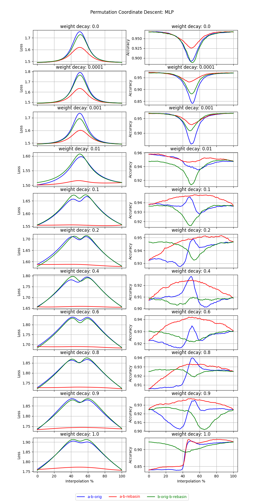
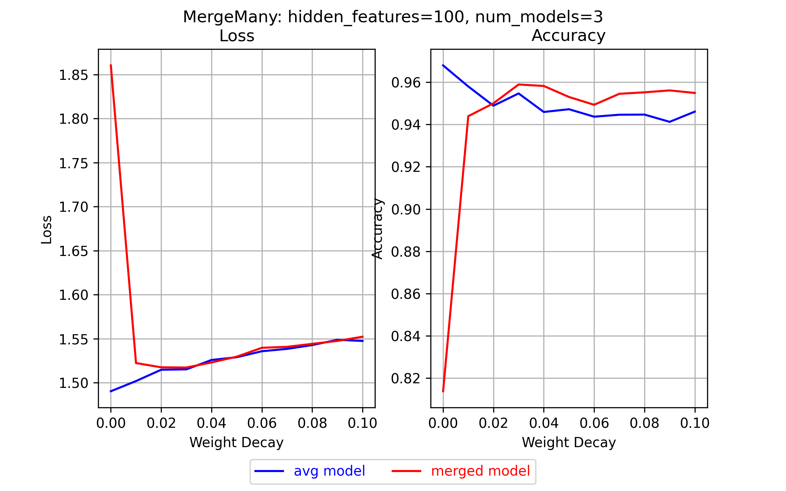
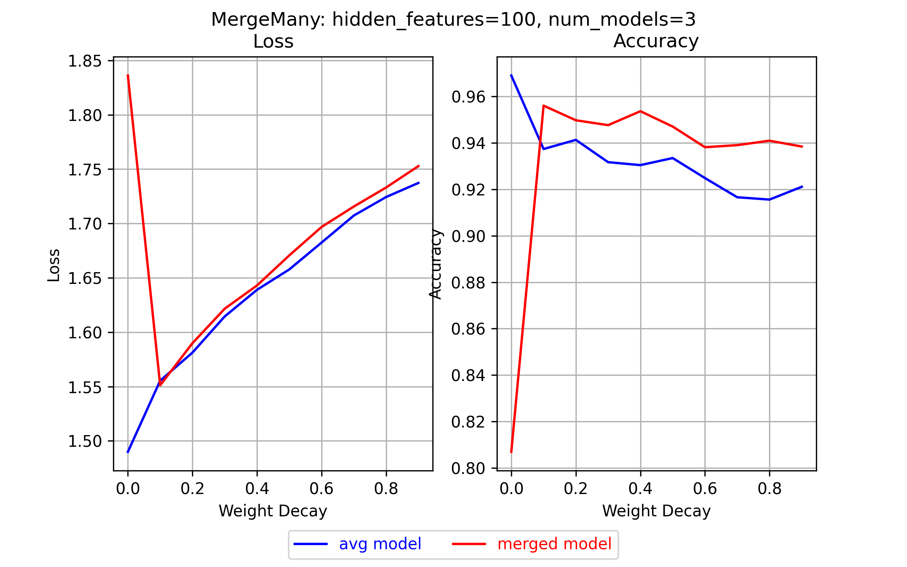
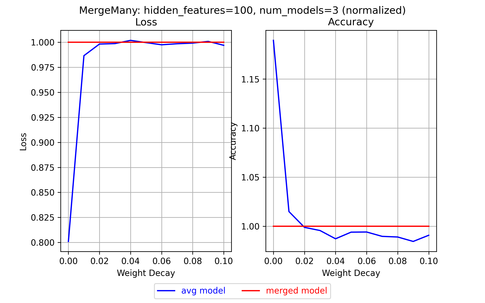
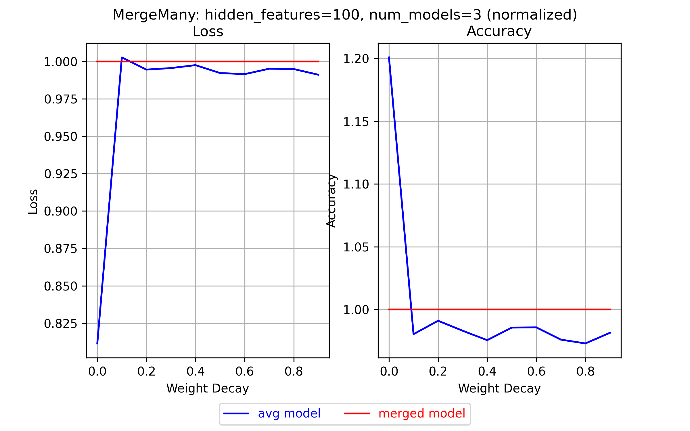
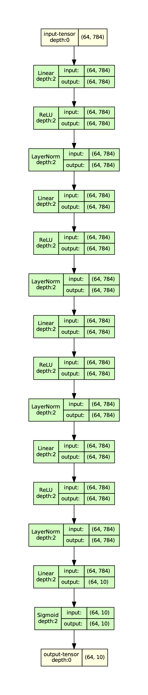

# MLP: Git Re-Basin results

These are results from running `PermutationCoordinateDescent` and `MergeMany` on MLPs.

## Results

### PermutationCoordinateDescent

I wanted to find out if `PermutationCoordinateDescent` works better with a higher L2-regularizer.
This would make sense, because then, the weights would be more similar in magnitude,
and therefore, more similar. Permuting them should work better.

Here are the results for an MLP (definition see [mlp_tests.py](mlp_tests.py))
with different settings for `weight_decay` in the `Adam` optimizer, 
which sets the L2-regularizer for the weights:

<p align="center">
    
</p>

And lo and behold, it works! The higher the L2-regularizer, the better the results, up to a point.

To be clear, better here means that the loss barrier is lower, not that the absolute loss is lower.
It's not, maybe because I've barely tuned the hyperparameters, and when I did, I did it 
without regularization, or it's because the `weight_decay` does get *very* high in some of these plots.

Some observations:

- At a `weight_decay` of 0.1, there is no longer a loss barrier. Increasing the `weight_decay` further
  doesn't seem to help.
- At the same time, the losses of the other interpolations have a strange dip in the middle, which
  is consistent over all further `weight_decay` values. I don't claim to know why this happens.
- It seems that for this model, interpolating between `model_a` and `model_b (rebasin)` yields
  higher-accuracy models than either of the original ones, if the `weight_decay` is high enough.
- Strange things happen to the accuracies at high `weight_decay` values. I don't know why.
- When the `weight_decay` is too high, a loss barrier start appearing again.

(Accuracy is top-1)

This is a clear success!!!

### MergeMany

The above makes it likely that `MergeMany` also works better with a higher L2-regularizer.

Here are the results:

<p align="center">
    
</p>

And for higher `weight_decay` values:

<p align="center">
    
</p>

The look promising, so let's normalize them by dividing by the loss / accuracy of the merged model 
at every step:

<p align="center">
    
</p>

<p align="center">
    
</p>

Clearly, with high `weight_decay`-values, `MergeMany` works pretty well; 
the loss is similar to that of the control model, and the accuracy is even higher.


## The model

<p align="center">
    
</p>

## The permutations

```
                                         
PathSequence(                            
-----------------------------------------
                                         
LinearPath(                              
  DefaultModule(                         
    module.type: Linear                  
    input.shape: [(64, 784)]             
    output.shape: [(64, 784)]            
    weight.in_dim.permutation: None      
    weight.out_dim.permutation.shape: 784
  )                                      
                                         
  InputPermIsOutputPermMultiDimModule(   
    module.type: LayerNorm               
    input.shape: [(64, 784)]             
    output.shape: [(64, 784)]            
    weight.in_dim.permutation.shape: 784 
    weight.out_dim.permutation.shape: 784
  )                                      
                                         
  DefaultModule(                         
    module.type: Linear                  
    input.shape: [(64, 784)]             
    output.shape: [(64, 784)]            
    weight.in_dim.permutation.shape: 784 
    weight.out_dim.permutation.shape: 784
  )                                      
                                         
  InputPermIsOutputPermMultiDimModule(   
    module.type: LayerNorm               
    input.shape: [(64, 784)]             
    output.shape: [(64, 784)]            
    weight.in_dim.permutation.shape: 784 
    weight.out_dim.permutation.shape: 784
  )                                      
                                         
  DefaultModule(                         
    module.type: Linear                  
    input.shape: [(64, 784)]             
    output.shape: [(64, 784)]            
    weight.in_dim.permutation.shape: 784 
    weight.out_dim.permutation.shape: 784
  )                                      
                                         
  InputPermIsOutputPermMultiDimModule(   
    module.type: LayerNorm               
    input.shape: [(64, 784)]             
    output.shape: [(64, 784)]            
    weight.in_dim.permutation.shape: 784 
    weight.out_dim.permutation.shape: 784
  )                                      
                                         
  DefaultModule(                         
    module.type: Linear                  
    input.shape: [(64, 784)]             
    output.shape: [(64, 784)]            
    weight.in_dim.permutation.shape: 784 
    weight.out_dim.permutation.shape: 784
  )                                      
                                         
  InputPermIsOutputPermMultiDimModule(   
    module.type: LayerNorm               
    input.shape: [(64, 784)]             
    output.shape: [(64, 784)]            
    weight.in_dim.permutation.shape: 784 
    weight.out_dim.permutation.shape: 784
  )                                      
                                         
  DefaultModule(                         
    module.type: Linear                  
    input.shape: [(64, 784)]             
    output.shape: [(64, 10)]             
    weight.in_dim.permutation.shape: 784 
    weight.out_dim.permutation: None     
  )                                      
                                         
)                                        
-----------------------------------------
)                                        
```
