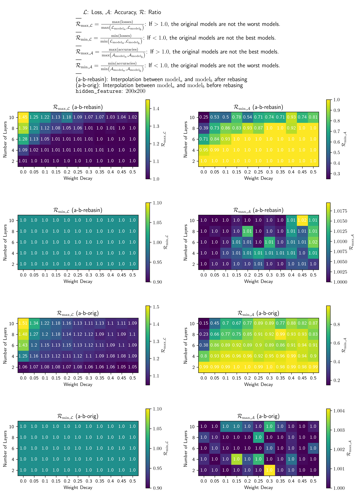
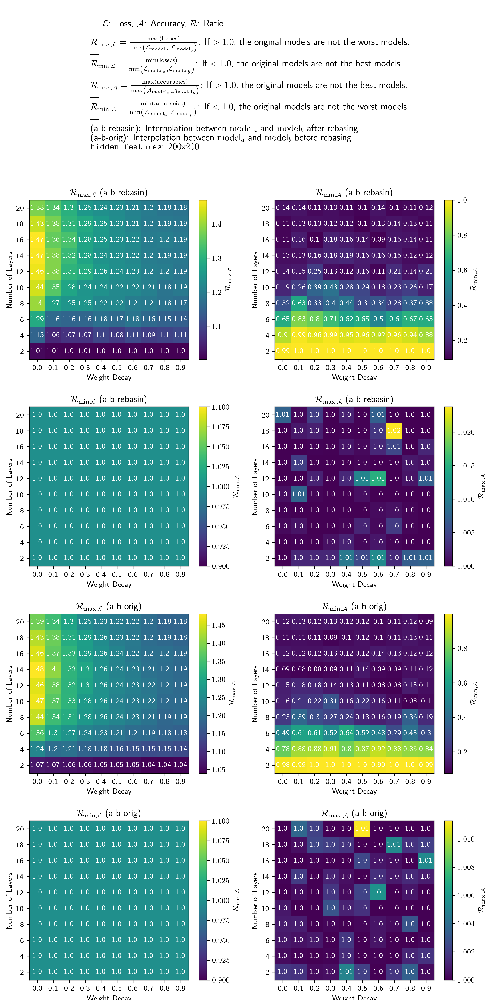
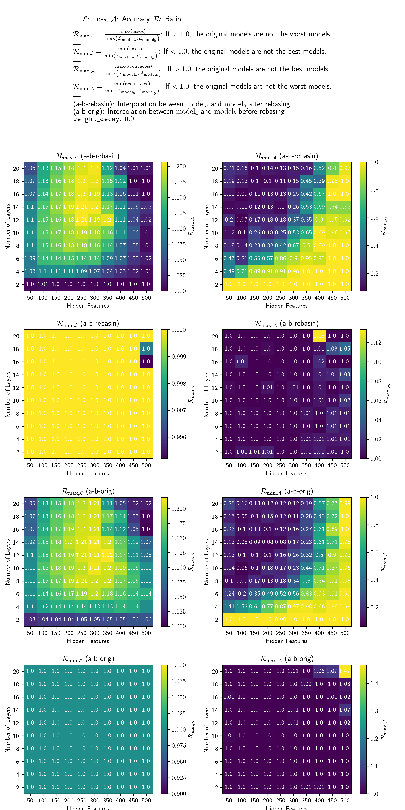
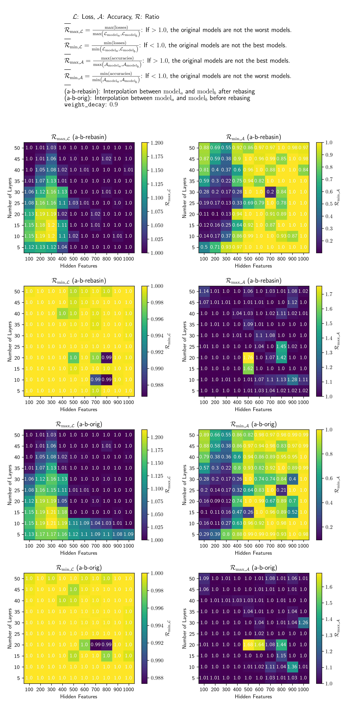
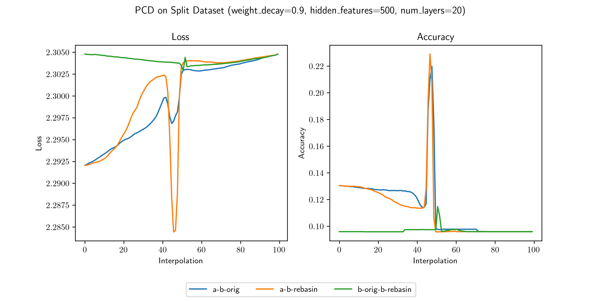
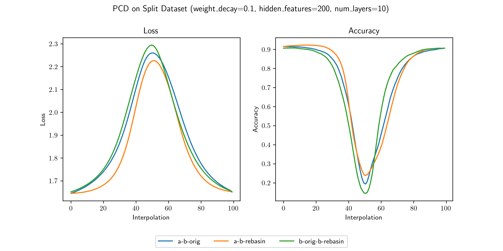
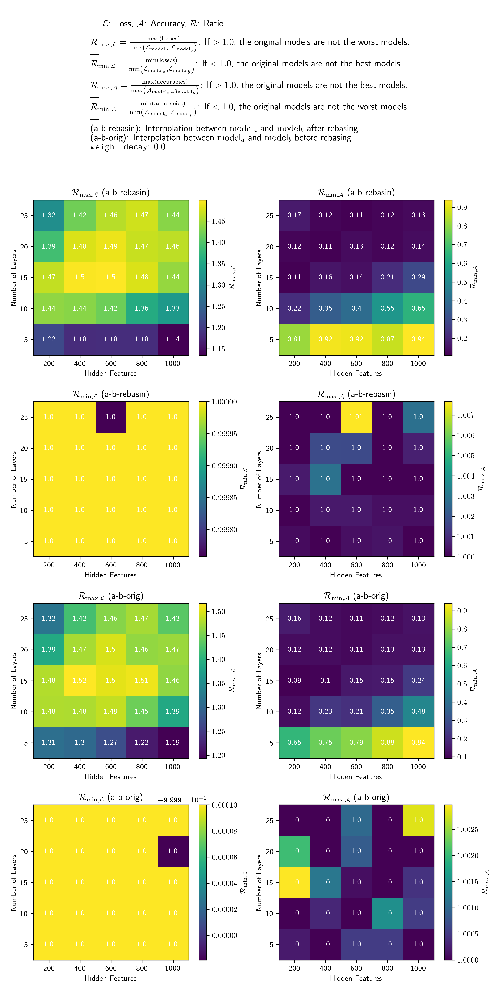
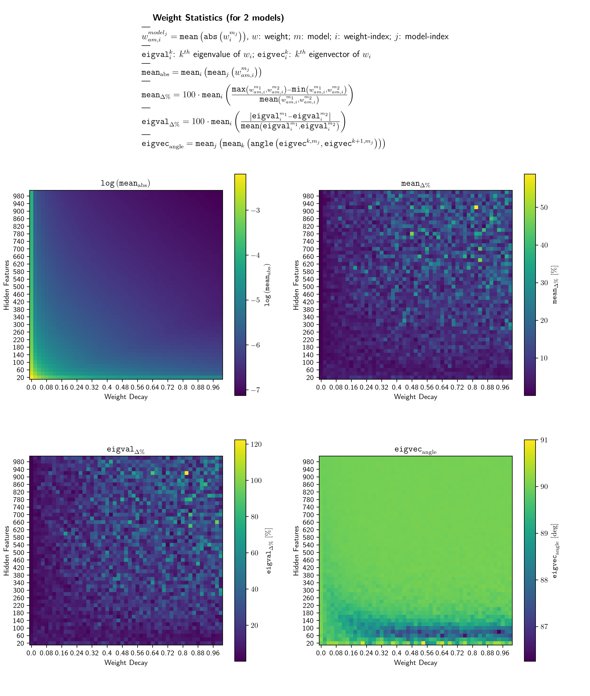
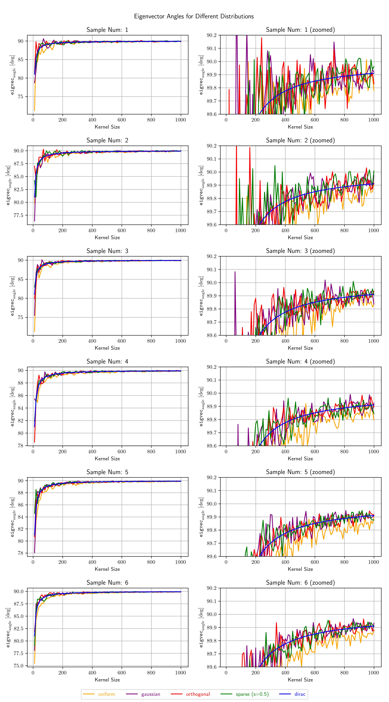
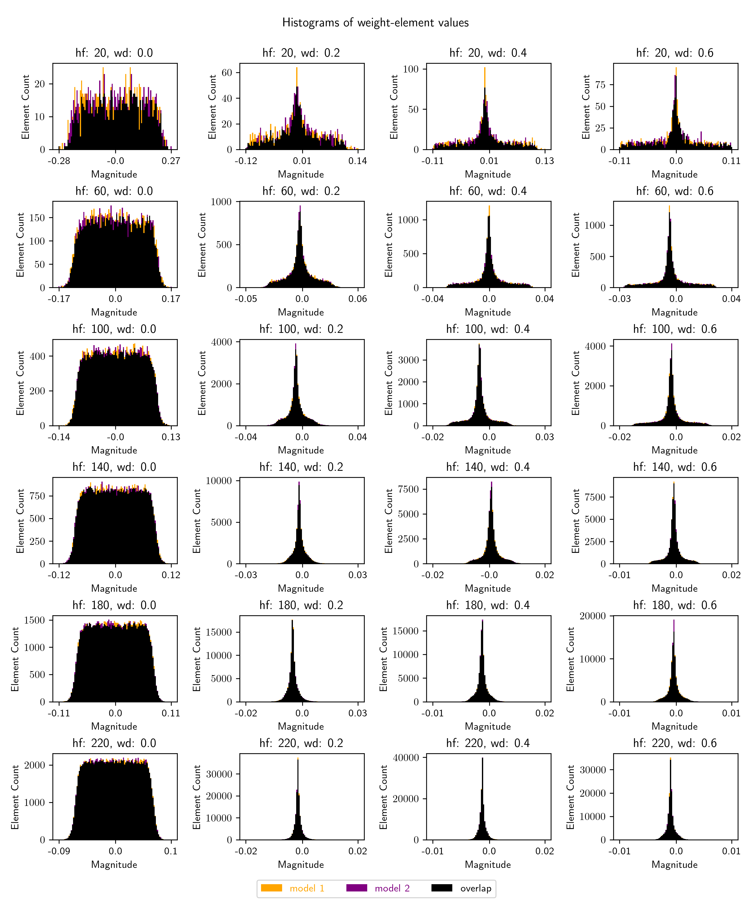

# MLP: Git Re-Basin results

These are results from running `PermutationCoordinateDescent` and `MergeMany` on MLPs.

**Table of Contents**

- [Results](#results)
  - [PermutationCoordinateDescent](#permutationcoordinatedescent)
    - [On disjunct datasets](#on-disjunct-datasets)
  - [MergeMany](#mergemany)
    - [By number of models](#by-number-of-models)
    - [By feature size](#by-feature-size)
    - [Larger sweeps](#larger-sweeps)
      - [Analyzing outputs](#analyzing-outputs)
      - [Analyzing the weights](#analyzing-the-weights)
- [The model](#the-model)
- [The permutations](#the-permutations)

# Results

Below is an analysis of the results of running 
`PermutationCoordinateDescent` and `MergeMany` on the MLP presented 
[here](#the-model).

## PermutationCoordinateDescent

I wanted to find out if `PermutationCoordinateDescent` works better with a higher L2-regularizer.
This would make sense, because then, the weights would be more similar in magnitude,
and therefore, more similar. Permuting them should work better.

Here are the results for an MLP (definition see [mlp_tests.py](mlp_tests.py))
with different settings for `weight_decay` in the `Adam` optimizer, 
which sets the L2-regularizer for the weights:

<p align="center">
    
</p>

And lo and behold, it works! The higher the L2-regularizer, the better the results, up to a point.

To be clear, better here means that the loss barrier is lower, not that the absolute loss is lower.
It's not, maybe because I've barely tuned the hyperparameters, and when I did, I did it 
without regularization, or it's because the `weight_decay` does get *very* high in some of these plots.

Some observations:

- At a `weight_decay` of 0.1, there is no longer a loss barrier. Increasing the `weight_decay` further
  doesn't seem to help.
- At the same time, the losses of the other interpolations have a strange dip in the middle, which
  is consistent over all further `weight_decay` values. I don't claim to know why this happens.
- It seems that for this model, interpolating between `model_a` and `model_b (rebasin)` yields
  higher-accuracy models than either of the original ones, if the `weight_decay` is high enough.
- Strange things happen to the accuracies at high `weight_decay` values. I don't know why.
- When the `weight_decay` is too high, a loss barrier start appearing again.

(Accuracy is top-1)

This is a clear success!!!

### On disjunct datasets

The above results are for two models trained on the same dataset.
I wanted to see if the different features that they learned could be combined into 
a model that performs better than either of the original ones.

Now, I would like to test the performance of `PermutationCoordinateDescent`
on two models trained on different datasets, as intended.
To do so, I've split MNIST into two disjunct parts and trained a model on each.
Then, I've run `PermutationCoordinateDescent` on them, and interpolated between them.

Please have a look at the definitions written in the image.
It essentially means the following: 
In the first and third row, 
values != 0 mean that the worst of the interpolated models is worse 
that the worst of the original ones,
while in the second and fourth row,
values != 0 mean that the best of the interpolated models is better
than the best of the original ones.

Here are the results:

<p align="center">
    
</p>

Observations:

- The original models always have the best loss, as shown by L_min. 
    This is as described in the paper.
- However, at high `weight_decay` values, 
    the loss of the worst of the interpolated models is barely higher 
    than that of the best original model,
    except at a high number of hidden layers.
- Both of the above statements are true for interpolating both between 
    `model_a` and `model_b (rebasin)` and between `model_a` and `model_b (original)`.
    However, it clearly works better with `model_b (rebasin)`.
- `PermutationCoordinateDescent` followed by interpolation can clearly 
    yield models with higher accuracy than either of the original ones, 
    if the `weight_decay` is high enough.
- This, again, works with both `model_b (rebasin)` and `model_b (original)`,
    and again, works better with `model_b (rebasin)`.
- With high enough `weight_decay`, the accuracy of the worst of the interpolated models
    is barely lower than that of the best original model, for `model_b (rebasin)`,
    except for a high number of hidden layers.
- The above is not true for `model_b (original)`.
- In total, `PermutationCoordinateDescent` works well on models trained on disjunct datasets,
    if the `weight_decay` is high enough and the number of hidden layers is not too high.

Let's push this to higher layer numbers and `weight_decay` values:

<p align="center">
    
</p>

Observations:

- Beyond a certain `weight_decay`-value, higher `weight_decay` doesn't seem to help.
- Beyond a certain number of layers, the performance is bad for all `weight_decay` values.
- Otherwise, the observations from above still hold.

However, this was done at a fixed number of features per layer (which I call `hidden_features`).
Let's see what happens when we increase the number of features per layer
at a fixed `weight_decay`-value of 0.9 and with different numbers of layers:

<p align="center">
    
</p>

Observations:
- At a low number of layers, the size of the hidden features doesn't matter.
- At a high number of layers, it is absolutely crucial.
- This makes me think that the method might work well on transformer models,
    because their feature-sizes are fairly large compared to their number of layers.
- At the extremely high `weight_decay`-value that was chosen, 
    it doesn't seem to matter whether we use `model_b (rebasin)` or `model_b (original)`.
    In other words, `PermutationCoordinateDescent` is (apparently) only needed 
    for lower `weight_decay`-values (which are, of course, more realistic ones).

Let's see what happens when we increase the number of layers and `hidden_features` even further:

<p align="center">
    
</p>

Observations:
- The performance of the interpolated models (a-b-rebasin) is strongly correlated to that
    of the interpolated models (a-b-original).
- There is a weird area in the left upper corner of R_L,max where the interpolated
    models are not worse than the best of the original ones, even though the
    `hidden_features` are so low at a very high number of layers.
    This is reflected in the accuracy.
    It might be interesting to see if pushing the number of layers up even further 
    would reveal a similar pattern.
    That would mean that there isn't just a small area of good performance, 
    but instead a small area of bad performance, while the rest is all good!
- Here, the performance of the interpolated models from (a-b-rebasin)
    is better than that of the interpolated models from (a-b-original).
- The points where a model with significantly higher accuracy than the original models
    could be found seem to be to the right (many `hidden_features`) 
    and towards a fairly low number of layers, though not too low.
    With how few such points there are, however, I'm going to call this random for now.

There is one point where R_A,max is around 1.6; this is a ridiculously high value.
Let's plot this:

<p align="center">
    
</p>

Observations:
- Obviously, the interpolated models can be so much better than the original models
    is because those are just so damn terrible. 
    `weight_decay = 0.9` is a ridiculously high value and shouldn't be used.

So instead, let's plot something at a much more reasonable `weight_decay`-value of 0.1:

<p align="center">
    
</p>

Unfortunately, this doesn't look too good.
The loss- and accuracy-barriers are barely reduced.
Yes, `PermutationCoordinateDescent` helps a little bit,
but by no means enough to be significant.

There is one last thing I want to try: Do a sweep such as the above, 
but with `weight_decay = 0.0`. Here are the results:

<p align="center">
    
</p>

Observations:
- This obviously works significantly worse than at high `weight_decay`-values.
- If I may speculate a bit: it will likely work much better `weight_decay`-values of 0.1
    already; 0.9 isn't needed. 
    It will also likely work much better with larger `hidden_features`-values.


#### Summary

All in all, `PermutationCoordinateDescent` doesn't seem to work too well 
on models trained on disjunct datasets.
It significantly reduces the loss- and accuracy-barrier for some settings,
and through interpolation, models with much higher accuracy than the original ones 
can even be found.
However, this is only the case for models that are already terrible.
For models that are good, `PermutationCoordinateDescent` 
barely reduces the loss- and accuracy-barrier at all.

## MergeMany

The above makes it likely that `MergeMany` also works better with a higher L2-regularizer.

Here are the results:

<p align="center">
    
</p>

And for higher `weight_decay` values:

<p align="center">
    
</p>

The look promising, so let's normalize them by dividing by the loss / accuracy of the merged model 
at every step:

<p align="center">
    
</p>

<p align="center">
    
</p>

Clearly, with high `weight_decay`-values, `MergeMany` works pretty well; 
the loss is similar to that of the control model, and the accuracy is even higher.

### By number of models

While `weight_decay` isn't mentioned as a factor influencing the 
results of `PermutationCoordinateDescent` and `MergeMany`
in the paper, it is clearly important. 

Another factor, however, is the number of models that are merged.
Ideally, more models would mean better results. However, in practice, the opposite is true.
At best, high `weight_decay` values are needed to get good results with many models,
though they are still not better than with fewer models.

<p align="center">
    
</p>

Observations:

- At low `weight_decay` values, `MergeMany` works significantly better with fewer models.
- At high `weight_decay` values, this effect almost disappears in the loss, 
   and seems to fully reduce the effect on accuracy &mdash; though that might be because
   the accuracy is a highly non-linear measure, making the data noisy.

### By feature-size

In the paper, `weight_decay` isn't mentioned as a factor 
influencing the results of `PermutationCoordinateDescent` and `MergeMany`.
On the other hand, feature-size is. So now, let's try `MergeMany` 
with different feature-sizes plotted over different `weight_decay` values.
The y-axis shows the ratio of the loss or accuracy of the merged model
to the loss or accuracy of the control model.

<p align="center">
    
</p>

Here, `avg` stands for the average of the three models from before they are merged,
and `merged` stands for the merged model.

What becomes clear is that while the feature-size is very important at low `weight_decay` values,
it becomes almost irrelevant at higher `weight_decay` values. The `weight_decay`-value, 
on the other hand, is very important for `MergeMany`, irrespective of the feature-size
(though at higher feature-size, it isn't quite as important as at lower feature-size).

Let's take a closer look at lower `weight_decay` values:

<p align="center">
    
</p>

Even a pretty low `weight_decay` appears to help `MergeMany` a lot.

Interestingly, the merged model never reaches a loss as low as the average of the models 
that make it up, but its top-1 accuracy is often higher. 
My hypothesis for why that is, is the following:

The merged model acts as an Ensemble, but the outputs of the Ensemble are averaged,
meaning that the outputs should come closer to their mean. This would express itself
in two things: 1.) The maximum output would be lower, and 2.) so would the standard deviation.
This would result in more uniform outputs, and thus a higher loss, 
but the results might still be better (as long as the information in the outputs
isn't averaged out into noise), resulting in a higher accuracy.

This view is supported by the following measurements. These show the ratio of 
some metric from the merged model to the same metric from the average of the models
that make it up. The metrics are accuracy, loss, maximum output, and standard deviation
of the outputs.

<p align="center">
    
</p>

It's clear that the maximum output and the standard deviation of the outputs
are lower in the merged model than in the models that make it up, while loss and
accuracy are higher. 

An exception to this is the case where `weight_decay == 0.0`; the behavior in this case
is probably explained by `PermutationCoordinateDescent` &mdash; which is used
by `MergeMany` &mdash; achieving a worse fit between the models. The permuted models are
averaged, so if they fit poorly, they will converge towards random noise. 

This view is supported by the number of permutations that are applied to the models
before they are merged, at different `weigth_decay` values:

<p align="center">
    
</p>

The number of permutations rises quickly at low `weight_decay`-values,
but then almost levels off. Clearly, an L2-regulizer helps `PermutationCoordinateDescent`
and, with that, `MergeMany`. It should be noted, however, that the difference in 
permutation counts isn't very large in relative terms. The lower two plots
show the same data, but with the y-axis scaled to start from 0, and it 
clearly shows this.

### Larger Sweeps

To find answers, let's do larger hyperparameter sweeps!

#### Analyzing outputs

This first image shows four outputs over `weight_decay` and `feature_size`:

1. The ratio of the loss of the merged model to the loss of the average of the models
   that make it up. (lower is better)
2. The ratio of the accuracy of the merged model to the accuracy of the average of the models
   that make it up. (higher is better)
3. The ratio of the maximum output of the merged model to the maximum output of the average of the models
   that make it up. (higher is better, because it means that the merged model is more confident)
4. The ratio of the standard deviation of the outputs of the merged model to the standard deviation
   of the outputs of the average of the models that make it up. (higher is better, because it means
   that the merged model is more confident)

<p align="center">
    
</p>

Let's analyze this:

- At low `weight_decay`-values, the std- and max-ratios are very low,
    while the loss and accuracy ratios are very high. 
    This makes me think that the reason that `weight_decay` is so important
    for `MergeMany` is that it makes the models more confident, and thus
    the averaging done in `MergeMany` doesn't average out the information
    in the outputs into noise, at least not as much.
- The feature-size, on the other hand, barely has an impact on this.
    Higher feature-size slightly increases the std- and max-ratios,
    but it's not very significant.
- The std- and max-ratios seem to worsen with the number of models that are merged.
    This is probably because the averaging done in `MergeMany` averages out
    the information in the outputs into noise, and the more models are merged,
    the more averaging is done.
    This effect is, however, reduced significantly at higher `weight_decay`-values.
- The fact that the std-ratio looks almost identical to the accuracy-ratio 
    seems to be more evidence for the hypothesis that the reason that `weight_decay`
    is so important for `MergeMany` is that it makes the models more confident.
- High `weight-decay`-values improve the accuracy of the merged model
    as compared to the average of the models that make it up.
    It seems that at a larger number of models that are merged,
    this happens more reliably (as evidenced by the less noisy image)

#### Analyzing the weights

In the following image, four values are plotted over `weight_decay` and `feature_size`:

1. The mean value of the elements of each weight.
2. The mean difference between the magnitude of the elements of the same weights in two models, 
    over all the weights in these models, in percent.
3. The mean difference between the mean eigenvalue of the weights in two models, 
    over all the weights in these models, in percent.
    This should, of course, correspond directly to the previous value.
    I did, however, calculate both to make sure that I didn't make a mistake.
4. The mean angle between a weight's eigenvectors in degrees.
    Measuring this values was a pot-shot.

<p align="center">
    

Let's analyze this:

- The mean value of the elements decreases with 
    both increasing feature-size and `weight_decay`.
    This is as expected. 
    Weights in `nn.Linear`-layers are initialized using
    `torch.nn.init.kaiming_uniform_`, which draws from a uniform distribution
    which has a range that decreases with increasing input-feature size.
    The `weight_decay`-term in the loss-function also decreases the weights,
    because it is a L2-regularizer.
- Both the percentage variation in the magnitude of the weights and the percentage variation
    in the mean eigenvalue of the weights increase with both increasing `weight_decay`
    and increasing feature-size.
    This might be an explanation for why both improve the results of `MergeMany`.
    As described [above](#analyzing-outputs), `weight_decay` makes the models more confident,
    and this might be because there is larger variation in the weight-values 
    of the models that are merged. 
    This might offset the fact that in `MergeMany`, 
    the weights of the merged models are averaged after being re-basined.
    In other words, hight `weight_decay`-values and feature-sizes
    might make the merged model more confident because they allow for 
    some variation in the magnitudes of the elements of the weights.
- The average angle between the eigenvectors of the weights is always around 90°...
    except for low feature-sizes at medium to high `weight_decay`-values.
    I have no idea why this is the case or what it means, but will attempt to analyze it further.

I would like to take a closer look at the last point. 

**Why does the angle between the eigenvectors look so strange?**

My first idea (before go through the effort of creating a histogram)
was to just plot the eigenvector-angles for different distributions 
at different kernel-sizes.

The chosen distributions are the following:

- **Uniform**
- **Normal**
- **Orthogonal**
- **Dirac**
- **Sparse Normal**

Here are the results:

<p align="center">
    
</p>

Let's analyze this:

- The angles between the eigenvectors for the Dirac distribution 
    very smoothly approach 90° as the feature-size increases,
    beginning at slightly over 80° at a feature-size of 10.
- The angles between the eigenvectors for the Uniform distribution
    track the angles for the Dirac distribution very closely, 
    with two differences:
    For one, they are shifted lower by, seemingly, lower than 0.1°,
    except at the beginning, where it's shifted by roughly 10°.
    Secondly, the average angle is extremely noisy. 
    It takes several samples to somewhat clean up the noise.
- The angles between the eigenvectors for all other distributions
    are also very noisy. They all track the Dirac distribution,
    but more closely than the Uniform distribution, because they 
    don't seem to be shifted down, except at the beginning,
    where the Gaussian distributions (Normal and Sparse Normal)
    are shifted down.
- It seems that the decreasing angle between eigenvectors
    at low feature-sizes is a normal phenomenon.
    Why this effect is stronger at higher `weight_decay`-values
    is, however, not explained by this. 
    It seems like L2-Regularization 
    (in the context of this model and training regime, on MNIST)
    changes the distribution of the weights.

This does not feel satisfying, so here is a histogram of the magnitudes of the
elements of the weights for different `weight_decay`-values and feature-sizes.
I've recorded then on two different training runs for each hyperparameter setting,
and entered the results for both into the histogram. In black you see 
the are of overlap, and in purple and orange you see where one of the models
has more entries at that bin than the other.

`wd` stands for `weight_decay`, `hf` for `hidden_features`
(a.k.a. the feature size;
each plot gives the histogram over three hidden weights of size `hf`x`hf`).

<p align="center">
    
</p>

Let's analyze this:

- First off, the histogram values barely change from training run to training run.
- At low `weight_decay`-values, the elements of the weights clearly 
    follow a uniform distribution &mdash; which should not be surprising,
    given that that's how they are initialized.
    This explains the behavior of the eigenvectors at low `weight_decay`-
    and feature-size values.
- At higher `weight_decay` values (and especially combined with greater feature sizes)
    the distribution becomes very much non-uniform, and, importantly, very sparse.
    The reason why the mean values of the weights are so different at high 
    `weight_decay` values is that this makes the means very susceptible to outliers.
- This ultimately makes me think that the reason that high `weight_decay`-values
    work so well for `PermutationCoordinateDescent` and `MergeMany` 
    is that they move the values of the weight elements
    very close together. This likely makes `model_b (rebasin)` fit more closely
    to `model_a`. The sparsity of the weights means that averaging the 
    weights from different models will retain some of the sparsity, 
    and thus (apparently) higher confidence in the outputs than 
    for uniformly distributed weight values.

### Summary

- `weight_decay` is very important for `MergeMany`, and should be set to a high value.
- The feature-size is important for `MergeMany` at low `weight_decay` values, but
  becomes less important at higher `weight_decay` values.
- The number of models used for merging negatively impacts the results of `MergeMany`
  at low `weight_decay` values, but becomes irrelevant at higher `weight_decay` values.
  (it might be interesting to check if it decreases bias, which is an important point
   of the paper)
- The merged model never reaches a loss as low as the average of the models that make it up,
  but its top-1 accuracy is often higher.
- The maximum output and the standard deviation of the outputs are lower in the merged model
  than in the models that make it up, while loss and accuracy are higher.
- The number of permutations rises quickly at low `weight_decay`-values,
  but then almost levels off.

# The model

<p align="center">
    
</p>

# The permutations

```
                                         
PathSequence(                            
-----------------------------------------
                                         
LinearPath(                              
  DefaultModule(                         
    module.type: Linear                  
    input.shape: [(64, 784)]             
    output.shape: [(64, 784)]            
    weight.in_dim.permutation: None      
    weight.out_dim.permutation.shape: 784
  )                                      
                                         
  InputPermIsOutputPermMultiDimModule(   
    module.type: LayerNorm               
    input.shape: [(64, 784)]             
    output.shape: [(64, 784)]            
    weight.in_dim.permutation.shape: 784 
    weight.out_dim.permutation.shape: 784
  )                                      
                                         
  DefaultModule(                         
    module.type: Linear                  
    input.shape: [(64, 784)]             
    output.shape: [(64, 784)]            
    weight.in_dim.permutation.shape: 784 
    weight.out_dim.permutation.shape: 784
  )                                      
                                         
  InputPermIsOutputPermMultiDimModule(   
    module.type: LayerNorm               
    input.shape: [(64, 784)]             
    output.shape: [(64, 784)]            
    weight.in_dim.permutation.shape: 784 
    weight.out_dim.permutation.shape: 784
  )                                      
                                         
  DefaultModule(                         
    module.type: Linear                  
    input.shape: [(64, 784)]             
    output.shape: [(64, 784)]            
    weight.in_dim.permutation.shape: 784 
    weight.out_dim.permutation.shape: 784
  )                                      
                                         
  InputPermIsOutputPermMultiDimModule(   
    module.type: LayerNorm               
    input.shape: [(64, 784)]             
    output.shape: [(64, 784)]            
    weight.in_dim.permutation.shape: 784 
    weight.out_dim.permutation.shape: 784
  )                                      
                                         
  DefaultModule(                         
    module.type: Linear                  
    input.shape: [(64, 784)]             
    output.shape: [(64, 784)]            
    weight.in_dim.permutation.shape: 784 
    weight.out_dim.permutation.shape: 784
  )                                      
                                         
  InputPermIsOutputPermMultiDimModule(   
    module.type: LayerNorm               
    input.shape: [(64, 784)]             
    output.shape: [(64, 784)]            
    weight.in_dim.permutation.shape: 784 
    weight.out_dim.permutation.shape: 784
  )                                      
                                         
  DefaultModule(                         
    module.type: Linear                  
    input.shape: [(64, 784)]             
    output.shape: [(64, 10)]             
    weight.in_dim.permutation.shape: 784 
    weight.out_dim.permutation: None     
  )                                      
                                         
)                                        
-----------------------------------------
)                                        
```
