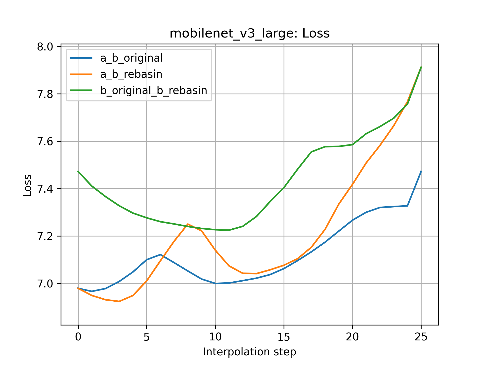

# torchvision.models.mobilenet_v3_large: Git Re-basin results

Here are results for interpolating between two sets of weights for 
[torchvision.models.mobilenet_v3_large](https://pytorch.org/vision/stable/models/generated/torchvision.models.mobilenet_v3_large.html#torchvision.models.mobilenet_v3_large).

## Caveat

It's very important to know that, as said in the paper, models with batchnorm layers
must have their running-stats recalculated for the new weights to work properly.

I do not have the budget to recalculate the running-stats for every interpolated model
on every one of ImageNet's 1.4 million images. That would take several days (weeks?) 
of A100 compute-time. Instead, I recalculated the running-stats for 200 batches of size 64
(12,800 images). This is not enough, and the results are not good, but I could see 
a significant improvement compared to using 50 batches of size 64 (3,200 images).

To make the comparison fair, I reset the original model's running-stats and then recalculated them
using 200 batches as the interpolated models. We can immediately see below that
for `MobileNet_V3_Large_Weights.IMAGENET1K_V1` this reduced 
top-1 accuracy from ~74% to below 20%.

Again, I'm sure that recalculating the batchnorm statistics on all 1.4 million images
would lead to much better results, but I don't have the budget for that. 
If somebody wants to do that, I'd be happy to include the results here. I'm sure
that this will lead to much better (and more meaningful) results. 

It might be enough to use 1000 batches of size 64 (64,000 images).

## Results

In the following, these are the weights used:

- `model_a`: `MobileNet_V3_Large_Weights.IMAGENET1K_V1`
- `model_b`: `MobileNet_V3_Large_Weights.IMAGENET1K_V2`

### `PermutationCoordinateDescent`

Here are the losses:

<p align="center">
    
</p>

Here are the top-1 accuracies:

<p align="center">
    
</p>

Here are the top-5 accuracies:

<p align="center">
    
</p>

It's obvious that the rebasined model is worse than either of the original models.
In theory, it should behave exactly like `model_b`, but the recalculation of the 
batchnorm running-stats leads to different results. I have to stress again 
that calculating the running stats with more data would lead to *much* better results.

## Model

<p align="center">
    
</p>

## Permutations

Here is the permutation spec:

```
PathSequence(                                                                          
--------------------------------------                                                 
                                                                                       
LinearPath(                                                                            
  DefaultModule(                                                                       
    module.type: Conv2d                                                                
    input.shape: [(64, 3, 224, 224)]                                                   
    output.shape: [(64, 16, 112, 112)]                                                 
    weight.in_dim.permutation: None                                                    
    weight.out_dim.permutation: None                                                   
  )                                                                                    
                                                                                       
  OneDimModule(                                                                        
    module.type: BatchNorm2d                                                           
    input.shape: [(64, 16, 112, 112)]                                                  
    output.shape: [(64, 16, 112, 112)]                                                 
    weight.in_dim.permutation: None                                                    
    weight.out_dim.permutation: None                                                   
  )                                                                                    
                                                                                       
)                                                                                      
--------------------------------------                                                 
                              |                                                        
                              |                                                        
                              |                                                        
--------------------------------------------------------------                         
ParallelPaths(                                                                         
  LinearPath(                                 LinearPath()                             
    DefaultModule(                                 |                                   
      module.type: Conv2d                          |                                   
      input.shape: [(64, 16, 112, 112)]            |                                   
      output.shape: [(64, 16, 112, 112)]           |                                   
      weight.in_dim.permutation: None              |                                   
      weight.out_dim.permutation.shape: 16         |                                   
    )                                              |                                   
                                                   |                                   
    OneDimModule(                                  |                                   
      module.type: BatchNorm2d                     |                                   
      input.shape: [(64, 16, 112, 112)]            |                                   
      output.shape: [(64, 16, 112, 112)]           |                                   
      weight.in_dim.permutation.shape: 16          |                                   
      weight.out_dim.permutation.shape: 16         |                                   
    )                                              |                                   
                                                   |                                   
    DefaultModule(                                 |                                   
      module.type: Conv2d                          |                                   
      input.shape: [(64, 16, 112, 112)]            |                                   
      output.shape: [(64, 16, 112, 112)]           |                                   
      weight.in_dim.permutation.shape: 16          |                                   
      weight.out_dim.permutation: None             |                                   
    )                                              |                                   
                                                   |                                   
    OneDimModule(                                  |                                   
      module.type: BatchNorm2d                     |                                   
      input.shape: [(64, 16, 112, 112)]            |                                   
      output.shape: [(64, 16, 112, 112)]           |                                   
      weight.in_dim.permutation: None              |                                   
      weight.out_dim.permutation: None             |                                   
    )                                              |                                   
                                                   |                                   
  )                                                |                                   
)                                                                                      
--------------------------------------------------------------                         
                   |                                                                   
                   |                                                                   
                   |                                                                   
----------------------------------------                                               
                                                                                       
LinearPath(                                                                            
  DefaultModule(                                                                       
    module.type: Conv2d                                                                
    input.shape: [(64, 16, 112, 112)]                                                  
    output.shape: [(64, 64, 112, 112)]                                                 
    weight.in_dim.permutation: None                                                    
    weight.out_dim.permutation.shape: 64                                               
  )                                                                                    
                                                                                       
  OneDimModule(                                                                        
    module.type: BatchNorm2d                                                           
    input.shape: [(64, 64, 112, 112)]                                                  
    output.shape: [(64, 64, 112, 112)]                                                 
    weight.in_dim.permutation.shape: 64                                                
    weight.out_dim.permutation.shape: 64                                               
  )                                                                                    
                                                                                       
  DefaultModule(                                                                       
    module.type: Conv2d                                                                
    input.shape: [(64, 64, 112, 112)]                                                  
    output.shape: [(64, 64, 56, 56)]                                                   
    weight.in_dim.permutation.shape: 1                                                 
    weight.out_dim.permutation.shape: 64                                               
  )                                                                                    
                                                                                       
  OneDimModule(                                                                        
    module.type: BatchNorm2d                                                           
    input.shape: [(64, 64, 56, 56)]                                                    
    output.shape: [(64, 64, 56, 56)]                                                   
    weight.in_dim.permutation.shape: 64                                                
    weight.out_dim.permutation.shape: 64                                               
  )                                                                                    
                                                                                       
  DefaultModule(                                                                       
    module.type: Conv2d                                                                
    input.shape: [(64, 64, 56, 56)]                                                    
    output.shape: [(64, 24, 56, 56)]                                                   
    weight.in_dim.permutation.shape: 64                                                
    weight.out_dim.permutation.shape: 24                                               
  )                                                                                    
                                                                                       
  OneDimModule(                                                                        
    module.type: BatchNorm2d                                                           
    input.shape: [(64, 24, 56, 56)]                                                    
    output.shape: [(64, 24, 56, 56)]                                                   
    weight.in_dim.permutation.shape: 24                                                
    weight.out_dim.permutation.shape: 24                                               
  )                                                                                    
                                                                                       
)                                                                                      
----------------------------------------                                               
                              |                                                        
                              |                                                        
                              |                                                        
--------------------------------------------------------------                         
ParallelPaths(                                                                         
  LinearPath(                                 LinearPath()                             
    DefaultModule(                                 |                                   
      module.type: Conv2d                          |                                   
      input.shape: [(64, 24, 56, 56)]              |                                   
      output.shape: [(64, 72, 56, 56)]             |                                   
      weight.in_dim.permutation.shape: 24          |                                   
      weight.out_dim.permutation.shape: 72         |                                   
    )                                              |                                   
                                                   |                                   
    OneDimModule(                                  |                                   
      module.type: BatchNorm2d                     |                                   
      input.shape: [(64, 72, 56, 56)]              |                                   
      output.shape: [(64, 72, 56, 56)]             |                                   
      weight.in_dim.permutation.shape: 72          |                                   
      weight.out_dim.permutation.shape: 72         |                                   
    )                                              |                                   
                                                   |                                   
    DefaultModule(                                 |                                   
      module.type: Conv2d                          |                                   
      input.shape: [(64, 72, 56, 56)]              |                                   
      output.shape: [(64, 72, 56, 56)]             |                                   
      weight.in_dim.permutation.shape: 1           |                                   
      weight.out_dim.permutation.shape: 72         |                                   
    )                                              |                                   
                                                   |                                   
    OneDimModule(                                  |                                   
      module.type: BatchNorm2d                     |                                   
      input.shape: [(64, 72, 56, 56)]              |                                   
      output.shape: [(64, 72, 56, 56)]             |                                   
      weight.in_dim.permutation.shape: 72          |                                   
      weight.out_dim.permutation.shape: 72         |                                   
    )                                              |                                   
                                                   |                                   
    DefaultModule(                                 |                                   
      module.type: Conv2d                          |                                   
      input.shape: [(64, 72, 56, 56)]              |                                   
      output.shape: [(64, 24, 56, 56)]             |                                   
      weight.in_dim.permutation.shape: 72          |                                   
      weight.out_dim.permutation.shape: 24         |                                   
    )                                              |                                   
                                                   |                                   
    OneDimModule(                                  |                                   
      module.type: BatchNorm2d                     |                                   
      input.shape: [(64, 24, 56, 56)]              |                                   
      output.shape: [(64, 24, 56, 56)]             |                                   
      weight.in_dim.permutation.shape: 24          |                                   
      weight.out_dim.permutation.shape: 24         |                                   
    )                                              |                                   
                                                   |                                   
  )                                                |                                   
)                                                                                      
--------------------------------------------------------------                         
                   |                                                                   
                   |                                                                   
                   |                                                                   
----------------------------------------                                               
                                                                                       
LinearPath(                                                                            
  DefaultModule(                                                                       
    module.type: Conv2d                                                                
    input.shape: [(64, 24, 56, 56)]                                                    
    output.shape: [(64, 72, 56, 56)]                                                   
    weight.in_dim.permutation.shape: 24                                                
    weight.out_dim.permutation.shape: 72                                               
  )                                                                                    
                                                                                       
  OneDimModule(                                                                        
    module.type: BatchNorm2d                                                           
    input.shape: [(64, 72, 56, 56)]                                                    
    output.shape: [(64, 72, 56, 56)]                                                   
    weight.in_dim.permutation.shape: 72                                                
    weight.out_dim.permutation.shape: 72                                               
  )                                                                                    
                                                                                       
  DefaultModule(                                                                       
    module.type: Conv2d                                                                
    input.shape: [(64, 72, 56, 56)]                                                    
    output.shape: [(64, 72, 28, 28)]                                                   
    weight.in_dim.permutation.shape: 1                                                 
    weight.out_dim.permutation: None                                                   
  )                                                                                    
                                                                                       
  OneDimModule(                                                                        
    module.type: BatchNorm2d                                                           
    input.shape: [(64, 72, 28, 28)]                                                    
    output.shape: [(64, 72, 28, 28)]                                                   
    weight.in_dim.permutation: None                                                    
    weight.out_dim.permutation: None                                                   
  )                                                                                    
                                                                                       
)                                                                                      
----------------------------------------                                               
                              |                                                        
                              |                                                        
                              |                                                        
--------------------------------------------------------------                         
ParallelPaths(                                                                         
  LinearPath(                                 LinearPath()                             
    DefaultModule(                                 |                                   
      module.type: Conv2d                          |                                   
      input.shape: [(64, 72, 1, 1)]                |                                   
      output.shape: [(64, 24, 1, 1)]               |                                   
      weight.in_dim.permutation: None              |                                   
      weight.out_dim.permutation.shape: 24         |                                   
    )                                              |                                   
                                                   |                                   
    DefaultModule(                                 |                                   
      module.type: Conv2d                          |                                   
      input.shape: [(64, 24, 1, 1)]                |                                   
      output.shape: [(64, 72, 1, 1)]               |                                   
      weight.in_dim.permutation.shape: 24          |                                   
      weight.out_dim.permutation: None             |                                   
    )                                              |                                   
                                                   |                                   
  )                                                |                                   
)                                                                                      
--------------------------------------------------------------                         
                   |                                                                   
                   |                                                                   
                   |                                                                   
----------------------------------------                                               
                                                                                       
LinearPath(                                                                            
  DefaultModule(                                                                       
    module.type: Conv2d                                                                
    input.shape: [(64, 72, 28, 28)]                                                    
    output.shape: [(64, 40, 28, 28)]                                                   
    weight.in_dim.permutation: None                                                    
    weight.out_dim.permutation.shape: 40                                               
  )                                                                                    
                                                                                       
  OneDimModule(                                                                        
    module.type: BatchNorm2d                                                           
    input.shape: [(64, 40, 28, 28)]                                                    
    output.shape: [(64, 40, 28, 28)]                                                   
    weight.in_dim.permutation.shape: 40                                                
    weight.out_dim.permutation.shape: 40                                               
  )                                                                                    
                                                                                       
)                                                                                      
----------------------------------------                                               
                                          |                                            
                                          |                                            
                                          |                                            
-------------------------------------------------------------------------------------- 
ParallelPaths(                                                                         
  PathSequence(                                                     LinearPath()       
  -----------------------------------------                              |             
                                                                         |             
  LinearPath(                                                            |             
    DefaultModule(                                                       |             
      module.type: Conv2d                                                |             
      input.shape: [(64, 40, 28, 28)]                                    |             
      output.shape: [(64, 120, 28, 28)]                                  |             
      weight.in_dim.permutation.shape: 40                                |             
      weight.out_dim.permutation.shape: 120                              |             
    )                                                                    |             
                                                                         |             
    OneDimModule(                                                        |             
      module.type: BatchNorm2d                                           |             
      input.shape: [(64, 120, 28, 28)]                                   |             
      output.shape: [(64, 120, 28, 28)]                                  |             
      weight.in_dim.permutation.shape: 120                               |             
      weight.out_dim.permutation.shape: 120                              |             
    )                                                                    |             
                                                                         |             
    DefaultModule(                                                       |             
      module.type: Conv2d                                                |             
      input.shape: [(64, 120, 28, 28)]                                   |             
      output.shape: [(64, 120, 28, 28)]                                  |             
      weight.in_dim.permutation.shape: 1                                 |             
      weight.out_dim.permutation: None                                   |             
    )                                                                    |             
                                                                         |             
    OneDimModule(                                                        |             
      module.type: BatchNorm2d                                           |             
      input.shape: [(64, 120, 28, 28)]                                   |             
      output.shape: [(64, 120, 28, 28)]                                  |             
      weight.in_dim.permutation: None                                    |             
      weight.out_dim.permutation: None                                   |             
    )                                                                    |             
                                                                         |             
  )                                                                      |             
  -----------------------------------------                              |             
                                |                                        |             
                                |                                        |             
                                |                                        |             
  --------------------------------------------------------------         |             
  ParallelPaths(                                                         |             
    LinearPath(                                 LinearPath()             |             
      DefaultModule(                                 |                   |             
        module.type: Conv2d                          |                   |             
        input.shape: [(64, 120, 1, 1)]               |                   |             
        output.shape: [(64, 32, 1, 1)]               |                   |             
        weight.in_dim.permutation: None              |                   |             
        weight.out_dim.permutation.shape: 32         |                   |             
      )                                              |                   |             
                                                     |                   |             
      DefaultModule(                                 |                   |             
        module.type: Conv2d                          |                   |             
        input.shape: [(64, 32, 1, 1)]                |                   |             
        output.shape: [(64, 120, 1, 1)]              |                   |             
        weight.in_dim.permutation.shape: 32          |                   |             
        weight.out_dim.permutation: None             |                   |             
      )                                              |                   |             
                                                     |                   |             
    )                                                |                   |             
  )                                                                      |             
  --------------------------------------------------------------         |             
                     |                                                   |             
                     |                                                   |             
                     |                                                   |             
  ----------------------------------------                               |             
                                                                         |             
  LinearPath(                                                            |             
    DefaultModule(                                                       |             
      module.type: Conv2d                                                |             
      input.shape: [(64, 120, 28, 28)]                                   |             
      output.shape: [(64, 40, 28, 28)]                                   |             
      weight.in_dim.permutation: None                                    |             
      weight.out_dim.permutation.shape: 40                               |             
    )                                                                    |             
                                                                         |             
    OneDimModule(                                                        |             
      module.type: BatchNorm2d                                           |             
      input.shape: [(64, 40, 28, 28)]                                    |             
      output.shape: [(64, 40, 28, 28)]                                   |             
      weight.in_dim.permutation.shape: 40                                |             
      weight.out_dim.permutation.shape: 40                               |             
    )                                                                    |             
                                                                         |             
  )                                                                      |             
  ----------------------------------------                               |             
  )                                                                      |             
)                                                                                      
-------------------------------------------------------------------------------------- 
                                          |                                            
                                          |                                            
                                          |                                            
-------------------------------------------------------------------------------------- 
ParallelPaths(                                                                         
  PathSequence(                                                     LinearPath()       
  -----------------------------------------                              |             
                                                                         |             
  LinearPath(                                                            |             
    DefaultModule(                                                       |             
      module.type: Conv2d                                                |             
      input.shape: [(64, 40, 28, 28)]                                    |             
      output.shape: [(64, 120, 28, 28)]                                  |             
      weight.in_dim.permutation.shape: 40                                |             
      weight.out_dim.permutation.shape: 120                              |             
    )                                                                    |             
                                                                         |             
    OneDimModule(                                                        |             
      module.type: BatchNorm2d                                           |             
      input.shape: [(64, 120, 28, 28)]                                   |             
      output.shape: [(64, 120, 28, 28)]                                  |             
      weight.in_dim.permutation.shape: 120                               |             
      weight.out_dim.permutation.shape: 120                              |             
    )                                                                    |             
                                                                         |             
    DefaultModule(                                                       |             
      module.type: Conv2d                                                |             
      input.shape: [(64, 120, 28, 28)]                                   |             
      output.shape: [(64, 120, 28, 28)]                                  |             
      weight.in_dim.permutation.shape: 1                                 |             
      weight.out_dim.permutation: None                                   |             
    )                                                                    |             
                                                                         |             
    OneDimModule(                                                        |             
      module.type: BatchNorm2d                                           |             
      input.shape: [(64, 120, 28, 28)]                                   |             
      output.shape: [(64, 120, 28, 28)]                                  |             
      weight.in_dim.permutation: None                                    |             
      weight.out_dim.permutation: None                                   |             
    )                                                                    |             
                                                                         |             
  )                                                                      |             
  -----------------------------------------                              |             
                                |                                        |             
                                |                                        |             
                                |                                        |             
  --------------------------------------------------------------         |             
  ParallelPaths(                                                         |             
    LinearPath(                                 LinearPath()             |             
      DefaultModule(                                 |                   |             
        module.type: Conv2d                          |                   |             
        input.shape: [(64, 120, 1, 1)]               |                   |             
        output.shape: [(64, 32, 1, 1)]               |                   |             
        weight.in_dim.permutation: None              |                   |             
        weight.out_dim.permutation.shape: 32         |                   |             
      )                                              |                   |             
                                                     |                   |             
      DefaultModule(                                 |                   |             
        module.type: Conv2d                          |                   |             
        input.shape: [(64, 32, 1, 1)]                |                   |             
        output.shape: [(64, 120, 1, 1)]              |                   |             
        weight.in_dim.permutation.shape: 32          |                   |             
        weight.out_dim.permutation: None             |                   |             
      )                                              |                   |             
                                                     |                   |             
    )                                                |                   |             
  )                                                                      |             
  --------------------------------------------------------------         |             
                     |                                                   |             
                     |                                                   |             
                     |                                                   |             
  ----------------------------------------                               |             
                                                                         |             
  LinearPath(                                                            |             
    DefaultModule(                                                       |             
      module.type: Conv2d                                                |             
      input.shape: [(64, 120, 28, 28)]                                   |             
      output.shape: [(64, 40, 28, 28)]                                   |             
      weight.in_dim.permutation: None                                    |             
      weight.out_dim.permutation.shape: 40                               |             
    )                                                                    |             
                                                                         |             
    OneDimModule(                                                        |             
      module.type: BatchNorm2d                                           |             
      input.shape: [(64, 40, 28, 28)]                                    |             
      output.shape: [(64, 40, 28, 28)]                                   |             
      weight.in_dim.permutation.shape: 40                                |             
      weight.out_dim.permutation.shape: 40                               |             
    )                                                                    |             
                                                                         |             
  )                                                                      |             
  ----------------------------------------                               |             
  )                                                                      |             
)                                                                                      
-------------------------------------------------------------------------------------- 
                   |                                                                   
                   |                                                                   
                   |                                                                   
-----------------------------------------                                              
                                                                                       
LinearPath(                                                                            
  DefaultModule(                                                                       
    module.type: Conv2d                                                                
    input.shape: [(64, 40, 28, 28)]                                                    
    output.shape: [(64, 240, 28, 28)]                                                  
    weight.in_dim.permutation.shape: 40                                                
    weight.out_dim.permutation.shape: 240                                              
  )                                                                                    
                                                                                       
  OneDimModule(                                                                        
    module.type: BatchNorm2d                                                           
    input.shape: [(64, 240, 28, 28)]                                                   
    output.shape: [(64, 240, 28, 28)]                                                  
    weight.in_dim.permutation.shape: 240                                               
    weight.out_dim.permutation.shape: 240                                              
  )                                                                                    
                                                                                       
  DefaultModule(                                                                       
    module.type: Conv2d                                                                
    input.shape: [(64, 240, 28, 28)]                                                   
    output.shape: [(64, 240, 14, 14)]                                                  
    weight.in_dim.permutation.shape: 1                                                 
    weight.out_dim.permutation.shape: 240                                              
  )                                                                                    
                                                                                       
  OneDimModule(                                                                        
    module.type: BatchNorm2d                                                           
    input.shape: [(64, 240, 14, 14)]                                                   
    output.shape: [(64, 240, 14, 14)]                                                  
    weight.in_dim.permutation.shape: 240                                               
    weight.out_dim.permutation.shape: 240                                              
  )                                                                                    
                                                                                       
  DefaultModule(                                                                       
    module.type: Conv2d                                                                
    input.shape: [(64, 240, 14, 14)]                                                   
    output.shape: [(64, 80, 14, 14)]                                                   
    weight.in_dim.permutation.shape: 240                                               
    weight.out_dim.permutation.shape: 80                                               
  )                                                                                    
                                                                                       
  OneDimModule(                                                                        
    module.type: BatchNorm2d                                                           
    input.shape: [(64, 80, 14, 14)]                                                    
    output.shape: [(64, 80, 14, 14)]                                                   
    weight.in_dim.permutation.shape: 80                                                
    weight.out_dim.permutation.shape: 80                                               
  )                                                                                    
                                                                                       
)                                                                                      
-----------------------------------------                                              
                              |                                                        
                              |                                                        
                              |                                                        
---------------------------------------------------------------                        
ParallelPaths(                                                                         
  LinearPath(                                  LinearPath()                            
    DefaultModule(                                  |                                  
      module.type: Conv2d                           |                                  
      input.shape: [(64, 80, 14, 14)]               |                                  
      output.shape: [(64, 200, 14, 14)]             |                                  
      weight.in_dim.permutation.shape: 80           |                                  
      weight.out_dim.permutation.shape: 200         |                                  
    )                                               |                                  
                                                    |                                  
    OneDimModule(                                   |                                  
      module.type: BatchNorm2d                      |                                  
      input.shape: [(64, 200, 14, 14)]              |                                  
      output.shape: [(64, 200, 14, 14)]             |                                  
      weight.in_dim.permutation.shape: 200          |                                  
      weight.out_dim.permutation.shape: 200         |                                  
    )                                               |                                  
                                                    |                                  
    DefaultModule(                                  |                                  
      module.type: Conv2d                           |                                  
      input.shape: [(64, 200, 14, 14)]              |                                  
      output.shape: [(64, 200, 14, 14)]             |                                  
      weight.in_dim.permutation.shape: 1            |                                  
      weight.out_dim.permutation.shape: 200         |                                  
    )                                               |                                  
                                                    |                                  
    OneDimModule(                                   |                                  
      module.type: BatchNorm2d                      |                                  
      input.shape: [(64, 200, 14, 14)]              |                                  
      output.shape: [(64, 200, 14, 14)]             |                                  
      weight.in_dim.permutation.shape: 200          |                                  
      weight.out_dim.permutation.shape: 200         |                                  
    )                                               |                                  
                                                    |                                  
    DefaultModule(                                  |                                  
      module.type: Conv2d                           |                                  
      input.shape: [(64, 200, 14, 14)]              |                                  
      output.shape: [(64, 80, 14, 14)]              |                                  
      weight.in_dim.permutation.shape: 200          |                                  
      weight.out_dim.permutation.shape: 80          |                                  
    )                                               |                                  
                                                    |                                  
    OneDimModule(                                   |                                  
      module.type: BatchNorm2d                      |                                  
      input.shape: [(64, 80, 14, 14)]               |                                  
      output.shape: [(64, 80, 14, 14)]              |                                  
      weight.in_dim.permutation.shape: 80           |                                  
      weight.out_dim.permutation.shape: 80          |                                  
    )                                               |                                  
                                                    |                                  
  )                                                 |                                  
)                                                                                      
---------------------------------------------------------------                        
                              |                                                        
                              |                                                        
                              |                                                        
---------------------------------------------------------------                        
ParallelPaths(                                                                         
  LinearPath(                                  LinearPath()                            
    DefaultModule(                                  |                                  
      module.type: Conv2d                           |                                  
      input.shape: [(64, 80, 14, 14)]               |                                  
      output.shape: [(64, 184, 14, 14)]             |                                  
      weight.in_dim.permutation.shape: 80           |                                  
      weight.out_dim.permutation.shape: 184         |                                  
    )                                               |                                  
                                                    |                                  
    OneDimModule(                                   |                                  
      module.type: BatchNorm2d                      |                                  
      input.shape: [(64, 184, 14, 14)]              |                                  
      output.shape: [(64, 184, 14, 14)]             |                                  
      weight.in_dim.permutation.shape: 184          |                                  
      weight.out_dim.permutation.shape: 184         |                                  
    )                                               |                                  
                                                    |                                  
    DefaultModule(                                  |                                  
      module.type: Conv2d                           |                                  
      input.shape: [(64, 184, 14, 14)]              |                                  
      output.shape: [(64, 184, 14, 14)]             |                                  
      weight.in_dim.permutation.shape: 1            |                                  
      weight.out_dim.permutation.shape: 184         |                                  
    )                                               |                                  
                                                    |                                  
    OneDimModule(                                   |                                  
      module.type: BatchNorm2d                      |                                  
      input.shape: [(64, 184, 14, 14)]              |                                  
      output.shape: [(64, 184, 14, 14)]             |                                  
      weight.in_dim.permutation.shape: 184          |                                  
      weight.out_dim.permutation.shape: 184         |                                  
    )                                               |                                  
                                                    |                                  
    DefaultModule(                                  |                                  
      module.type: Conv2d                           |                                  
      input.shape: [(64, 184, 14, 14)]              |                                  
      output.shape: [(64, 80, 14, 14)]              |                                  
      weight.in_dim.permutation.shape: 184          |                                  
      weight.out_dim.permutation.shape: 80          |                                  
    )                                               |                                  
                                                    |                                  
    OneDimModule(                                   |                                  
      module.type: BatchNorm2d                      |                                  
      input.shape: [(64, 80, 14, 14)]               |                                  
      output.shape: [(64, 80, 14, 14)]              |                                  
      weight.in_dim.permutation.shape: 80           |                                  
      weight.out_dim.permutation.shape: 80          |                                  
    )                                               |                                  
                                                    |                                  
  )                                                 |                                  
)                                                                                      
---------------------------------------------------------------                        
                              |                                                        
                              |                                                        
                              |                                                        
---------------------------------------------------------------                        
ParallelPaths(                                                                         
  LinearPath(                                  LinearPath()                            
    DefaultModule(                                  |                                  
      module.type: Conv2d                           |                                  
      input.shape: [(64, 80, 14, 14)]               |                                  
      output.shape: [(64, 184, 14, 14)]             |                                  
      weight.in_dim.permutation.shape: 80           |                                  
      weight.out_dim.permutation.shape: 184         |                                  
    )                                               |                                  
                                                    |                                  
    OneDimModule(                                   |                                  
      module.type: BatchNorm2d                      |                                  
      input.shape: [(64, 184, 14, 14)]              |                                  
      output.shape: [(64, 184, 14, 14)]             |                                  
      weight.in_dim.permutation.shape: 184          |                                  
      weight.out_dim.permutation.shape: 184         |                                  
    )                                               |                                  
                                                    |                                  
    DefaultModule(                                  |                                  
      module.type: Conv2d                           |                                  
      input.shape: [(64, 184, 14, 14)]              |                                  
      output.shape: [(64, 184, 14, 14)]             |                                  
      weight.in_dim.permutation.shape: 1            |                                  
      weight.out_dim.permutation.shape: 184         |                                  
    )                                               |                                  
                                                    |                                  
    OneDimModule(                                   |                                  
      module.type: BatchNorm2d                      |                                  
      input.shape: [(64, 184, 14, 14)]              |                                  
      output.shape: [(64, 184, 14, 14)]             |                                  
      weight.in_dim.permutation.shape: 184          |                                  
      weight.out_dim.permutation.shape: 184         |                                  
    )                                               |                                  
                                                    |                                  
    DefaultModule(                                  |                                  
      module.type: Conv2d                           |                                  
      input.shape: [(64, 184, 14, 14)]              |                                  
      output.shape: [(64, 80, 14, 14)]              |                                  
      weight.in_dim.permutation.shape: 184          |                                  
      weight.out_dim.permutation.shape: 80          |                                  
    )                                               |                                  
                                                    |                                  
    OneDimModule(                                   |                                  
      module.type: BatchNorm2d                      |                                  
      input.shape: [(64, 80, 14, 14)]               |                                  
      output.shape: [(64, 80, 14, 14)]              |                                  
      weight.in_dim.permutation.shape: 80           |                                  
      weight.out_dim.permutation.shape: 80          |                                  
    )                                               |                                  
                                                    |                                  
  )                                                 |                                  
)                                                                                      
---------------------------------------------------------------                        
                   |                                                                   
                   |                                                                   
                   |                                                                   
-----------------------------------------                                              
                                                                                       
LinearPath(                                                                            
  DefaultModule(                                                                       
    module.type: Conv2d                                                                
    input.shape: [(64, 80, 14, 14)]                                                    
    output.shape: [(64, 480, 14, 14)]                                                  
    weight.in_dim.permutation.shape: 80                                                
    weight.out_dim.permutation.shape: 480                                              
  )                                                                                    
                                                                                       
  OneDimModule(                                                                        
    module.type: BatchNorm2d                                                           
    input.shape: [(64, 480, 14, 14)]                                                   
    output.shape: [(64, 480, 14, 14)]                                                  
    weight.in_dim.permutation.shape: 480                                               
    weight.out_dim.permutation.shape: 480                                              
  )                                                                                    
                                                                                       
  DefaultModule(                                                                       
    module.type: Conv2d                                                                
    input.shape: [(64, 480, 14, 14)]                                                   
    output.shape: [(64, 480, 14, 14)]                                                  
    weight.in_dim.permutation.shape: 1                                                 
    weight.out_dim.permutation: None                                                   
  )                                                                                    
                                                                                       
  OneDimModule(                                                                        
    module.type: BatchNorm2d                                                           
    input.shape: [(64, 480, 14, 14)]                                                   
    output.shape: [(64, 480, 14, 14)]                                                  
    weight.in_dim.permutation: None                                                    
    weight.out_dim.permutation: None                                                   
  )                                                                                    
                                                                                       
)                                                                                      
-----------------------------------------                                              
                              |                                                        
                              |                                                        
                              |                                                        
---------------------------------------------------------------                        
ParallelPaths(                                                                         
  LinearPath(                                  LinearPath()                            
    DefaultModule(                                  |                                  
      module.type: Conv2d                           |                                  
      input.shape: [(64, 480, 1, 1)]                |                                  
      output.shape: [(64, 120, 1, 1)]               |                                  
      weight.in_dim.permutation: None               |                                  
      weight.out_dim.permutation.shape: 120         |                                  
    )                                               |                                  
                                                    |                                  
    DefaultModule(                                  |                                  
      module.type: Conv2d                           |                                  
      input.shape: [(64, 120, 1, 1)]                |                                  
      output.shape: [(64, 480, 1, 1)]               |                                  
      weight.in_dim.permutation.shape: 120          |                                  
      weight.out_dim.permutation: None              |                                  
    )                                               |                                  
                                                    |                                  
  )                                                 |                                  
)                                                                                      
---------------------------------------------------------------                        
                   |                                                                   
                   |                                                                   
                   |                                                                   
-----------------------------------------                                              
                                                                                       
LinearPath(                                                                            
  DefaultModule(                                                                       
    module.type: Conv2d                                                                
    input.shape: [(64, 480, 14, 14)]                                                   
    output.shape: [(64, 112, 14, 14)]                                                  
    weight.in_dim.permutation: None                                                    
    weight.out_dim.permutation.shape: 112                                              
  )                                                                                    
                                                                                       
  OneDimModule(                                                                        
    module.type: BatchNorm2d                                                           
    input.shape: [(64, 112, 14, 14)]                                                   
    output.shape: [(64, 112, 14, 14)]                                                  
    weight.in_dim.permutation.shape: 112                                               
    weight.out_dim.permutation.shape: 112                                              
  )                                                                                    
                                                                                       
)                                                                                      
-----------------------------------------                                              
                                          |                                            
                                          |                                            
                                          |                                            
---------------------------------------------------------------------------------------
ParallelPaths(                                                                         
  PathSequence(                                                      LinearPath()      
  -----------------------------------------                               |            
                                                                          |            
  LinearPath(                                                             |            
    DefaultModule(                                                        |            
      module.type: Conv2d                                                 |            
      input.shape: [(64, 112, 14, 14)]                                    |            
      output.shape: [(64, 672, 14, 14)]                                   |            
      weight.in_dim.permutation.shape: 112                                |            
      weight.out_dim.permutation.shape: 672                               |            
    )                                                                     |            
                                                                          |            
    OneDimModule(                                                         |            
      module.type: BatchNorm2d                                            |            
      input.shape: [(64, 672, 14, 14)]                                    |            
      output.shape: [(64, 672, 14, 14)]                                   |            
      weight.in_dim.permutation.shape: 672                                |            
      weight.out_dim.permutation.shape: 672                               |            
    )                                                                     |            
                                                                          |            
    DefaultModule(                                                        |            
      module.type: Conv2d                                                 |            
      input.shape: [(64, 672, 14, 14)]                                    |            
      output.shape: [(64, 672, 14, 14)]                                   |            
      weight.in_dim.permutation.shape: 1                                  |            
      weight.out_dim.permutation: None                                    |            
    )                                                                     |            
                                                                          |            
    OneDimModule(                                                         |            
      module.type: BatchNorm2d                                            |            
      input.shape: [(64, 672, 14, 14)]                                    |            
      output.shape: [(64, 672, 14, 14)]                                   |            
      weight.in_dim.permutation: None                                     |            
      weight.out_dim.permutation: None                                    |            
    )                                                                     |            
                                                                          |            
  )                                                                       |            
  -----------------------------------------                               |            
                                |                                         |            
                                |                                         |            
                                |                                         |            
  ---------------------------------------------------------------         |            
  ParallelPaths(                                                          |            
    LinearPath(                                  LinearPath()             |            
      DefaultModule(                                  |                   |            
        module.type: Conv2d                           |                   |            
        input.shape: [(64, 672, 1, 1)]                |                   |            
        output.shape: [(64, 168, 1, 1)]               |                   |            
        weight.in_dim.permutation: None               |                   |            
        weight.out_dim.permutation.shape: 168         |                   |            
      )                                               |                   |            
                                                      |                   |            
      DefaultModule(                                  |                   |            
        module.type: Conv2d                           |                   |            
        input.shape: [(64, 168, 1, 1)]                |                   |            
        output.shape: [(64, 672, 1, 1)]               |                   |            
        weight.in_dim.permutation.shape: 168          |                   |            
        weight.out_dim.permutation: None              |                   |            
      )                                               |                   |            
                                                      |                   |            
    )                                                 |                   |            
  )                                                                       |            
  ---------------------------------------------------------------         |            
                     |                                                    |            
                     |                                                    |            
                     |                                                    |            
  -----------------------------------------                               |            
                                                                          |            
  LinearPath(                                                             |            
    DefaultModule(                                                        |            
      module.type: Conv2d                                                 |            
      input.shape: [(64, 672, 14, 14)]                                    |            
      output.shape: [(64, 112, 14, 14)]                                   |            
      weight.in_dim.permutation: None                                     |            
      weight.out_dim.permutation.shape: 112                               |            
    )                                                                     |            
                                                                          |            
    OneDimModule(                                                         |            
      module.type: BatchNorm2d                                            |            
      input.shape: [(64, 112, 14, 14)]                                    |            
      output.shape: [(64, 112, 14, 14)]                                   |            
      weight.in_dim.permutation.shape: 112                                |            
      weight.out_dim.permutation.shape: 112                               |            
    )                                                                     |            
                                                                          |            
  )                                                                       |            
  -----------------------------------------                               |            
  )                                                                       |            
)                                                                                      
---------------------------------------------------------------------------------------
                   |                                                                   
                   |                                                                   
                   |                                                                   
-----------------------------------------                                              
                                                                                       
LinearPath(                                                                            
  DefaultModule(                                                                       
    module.type: Conv2d                                                                
    input.shape: [(64, 112, 14, 14)]                                                   
    output.shape: [(64, 672, 14, 14)]                                                  
    weight.in_dim.permutation.shape: 112                                               
    weight.out_dim.permutation.shape: 672                                              
  )                                                                                    
                                                                                       
  OneDimModule(                                                                        
    module.type: BatchNorm2d                                                           
    input.shape: [(64, 672, 14, 14)]                                                   
    output.shape: [(64, 672, 14, 14)]                                                  
    weight.in_dim.permutation.shape: 672                                               
    weight.out_dim.permutation.shape: 672                                              
  )                                                                                    
                                                                                       
  DefaultModule(                                                                       
    module.type: Conv2d                                                                
    input.shape: [(64, 672, 14, 14)]                                                   
    output.shape: [(64, 672, 7, 7)]                                                    
    weight.in_dim.permutation.shape: 1                                                 
    weight.out_dim.permutation: None                                                   
  )                                                                                    
                                                                                       
  OneDimModule(                                                                        
    module.type: BatchNorm2d                                                           
    input.shape: [(64, 672, 7, 7)]                                                     
    output.shape: [(64, 672, 7, 7)]                                                    
    weight.in_dim.permutation: None                                                    
    weight.out_dim.permutation: None                                                   
  )                                                                                    
                                                                                       
)                                                                                      
-----------------------------------------                                              
                              |                                                        
                              |                                                        
                              |                                                        
---------------------------------------------------------------                        
ParallelPaths(                                                                         
  LinearPath(                                  LinearPath()                            
    DefaultModule(                                  |                                  
      module.type: Conv2d                           |                                  
      input.shape: [(64, 672, 1, 1)]                |                                  
      output.shape: [(64, 168, 1, 1)]               |                                  
      weight.in_dim.permutation: None               |                                  
      weight.out_dim.permutation.shape: 168         |                                  
    )                                               |                                  
                                                    |                                  
    DefaultModule(                                  |                                  
      module.type: Conv2d                           |                                  
      input.shape: [(64, 168, 1, 1)]                |                                  
      output.shape: [(64, 672, 1, 1)]               |                                  
      weight.in_dim.permutation.shape: 168          |                                  
      weight.out_dim.permutation: None              |                                  
    )                                               |                                  
                                                    |                                  
  )                                                 |                                  
)                                                                                      
---------------------------------------------------------------                        
                   |                                                                   
                   |                                                                   
                   |                                                                   
-----------------------------------------                                              
                                                                                       
LinearPath(                                                                            
  DefaultModule(                                                                       
    module.type: Conv2d                                                                
    input.shape: [(64, 672, 7, 7)]                                                     
    output.shape: [(64, 160, 7, 7)]                                                    
    weight.in_dim.permutation: None                                                    
    weight.out_dim.permutation.shape: 160                                              
  )                                                                                    
                                                                                       
  OneDimModule(                                                                        
    module.type: BatchNorm2d                                                           
    input.shape: [(64, 160, 7, 7)]                                                     
    output.shape: [(64, 160, 7, 7)]                                                    
    weight.in_dim.permutation.shape: 160                                               
    weight.out_dim.permutation.shape: 160                                              
  )                                                                                    
                                                                                       
)                                                                                      
-----------------------------------------                                              
                                          |                                            
                                          |                                            
                                          |                                            
---------------------------------------------------------------------------------------
ParallelPaths(                                                                         
  PathSequence(                                                      LinearPath()      
  -----------------------------------------                               |            
                                                                          |            
  LinearPath(                                                             |            
    DefaultModule(                                                        |            
      module.type: Conv2d                                                 |            
      input.shape: [(64, 160, 7, 7)]                                      |            
      output.shape: [(64, 960, 7, 7)]                                     |            
      weight.in_dim.permutation.shape: 160                                |            
      weight.out_dim.permutation.shape: 960                               |            
    )                                                                     |            
                                                                          |            
    OneDimModule(                                                         |            
      module.type: BatchNorm2d                                            |            
      input.shape: [(64, 960, 7, 7)]                                      |            
      output.shape: [(64, 960, 7, 7)]                                     |            
      weight.in_dim.permutation.shape: 960                                |            
      weight.out_dim.permutation.shape: 960                               |            
    )                                                                     |            
                                                                          |            
    DefaultModule(                                                        |            
      module.type: Conv2d                                                 |            
      input.shape: [(64, 960, 7, 7)]                                      |            
      output.shape: [(64, 960, 7, 7)]                                     |            
      weight.in_dim.permutation.shape: 1                                  |            
      weight.out_dim.permutation: None                                    |            
    )                                                                     |            
                                                                          |            
    OneDimModule(                                                         |            
      module.type: BatchNorm2d                                            |            
      input.shape: [(64, 960, 7, 7)]                                      |            
      output.shape: [(64, 960, 7, 7)]                                     |            
      weight.in_dim.permutation: None                                     |            
      weight.out_dim.permutation: None                                    |            
    )                                                                     |            
                                                                          |            
  )                                                                       |            
  -----------------------------------------                               |            
                                |                                         |            
                                |                                         |            
                                |                                         |            
  ---------------------------------------------------------------         |            
  ParallelPaths(                                                          |            
    LinearPath(                                  LinearPath()             |            
      DefaultModule(                                  |                   |            
        module.type: Conv2d                           |                   |            
        input.shape: [(64, 960, 1, 1)]                |                   |            
        output.shape: [(64, 240, 1, 1)]               |                   |            
        weight.in_dim.permutation: None               |                   |            
        weight.out_dim.permutation.shape: 240         |                   |            
      )                                               |                   |            
                                                      |                   |            
      DefaultModule(                                  |                   |            
        module.type: Conv2d                           |                   |            
        input.shape: [(64, 240, 1, 1)]                |                   |            
        output.shape: [(64, 960, 1, 1)]               |                   |            
        weight.in_dim.permutation.shape: 240          |                   |            
        weight.out_dim.permutation: None              |                   |            
      )                                               |                   |            
                                                      |                   |            
    )                                                 |                   |            
  )                                                                       |            
  ---------------------------------------------------------------         |            
                     |                                                    |            
                     |                                                    |            
                     |                                                    |            
  -----------------------------------------                               |            
                                                                          |            
  LinearPath(                                                             |            
    DefaultModule(                                                        |            
      module.type: Conv2d                                                 |            
      input.shape: [(64, 960, 7, 7)]                                      |            
      output.shape: [(64, 160, 7, 7)]                                     |            
      weight.in_dim.permutation: None                                     |            
      weight.out_dim.permutation.shape: 160                               |            
    )                                                                     |            
                                                                          |            
    OneDimModule(                                                         |            
      module.type: BatchNorm2d                                            |            
      input.shape: [(64, 160, 7, 7)]                                      |            
      output.shape: [(64, 160, 7, 7)]                                     |            
      weight.in_dim.permutation.shape: 160                                |            
      weight.out_dim.permutation.shape: 160                               |            
    )                                                                     |            
                                                                          |            
  )                                                                       |            
  -----------------------------------------                               |            
  )                                                                       |            
)                                                                                      
---------------------------------------------------------------------------------------
                                          |                                            
                                          |                                            
                                          |                                            
---------------------------------------------------------------------------------------
ParallelPaths(                                                                         
  PathSequence(                                                      LinearPath()      
  -----------------------------------------                               |            
                                                                          |            
  LinearPath(                                                             |            
    DefaultModule(                                                        |            
      module.type: Conv2d                                                 |            
      input.shape: [(64, 160, 7, 7)]                                      |            
      output.shape: [(64, 960, 7, 7)]                                     |            
      weight.in_dim.permutation.shape: 160                                |            
      weight.out_dim.permutation.shape: 960                               |            
    )                                                                     |            
                                                                          |            
    OneDimModule(                                                         |            
      module.type: BatchNorm2d                                            |            
      input.shape: [(64, 960, 7, 7)]                                      |            
      output.shape: [(64, 960, 7, 7)]                                     |            
      weight.in_dim.permutation.shape: 960                                |            
      weight.out_dim.permutation.shape: 960                               |            
    )                                                                     |            
                                                                          |            
    DefaultModule(                                                        |            
      module.type: Conv2d                                                 |            
      input.shape: [(64, 960, 7, 7)]                                      |            
      output.shape: [(64, 960, 7, 7)]                                     |            
      weight.in_dim.permutation.shape: 1                                  |            
      weight.out_dim.permutation: None                                    |            
    )                                                                     |            
                                                                          |            
    OneDimModule(                                                         |            
      module.type: BatchNorm2d                                            |            
      input.shape: [(64, 960, 7, 7)]                                      |            
      output.shape: [(64, 960, 7, 7)]                                     |            
      weight.in_dim.permutation: None                                     |            
      weight.out_dim.permutation: None                                    |            
    )                                                                     |            
                                                                          |            
  )                                                                       |            
  -----------------------------------------                               |            
                                |                                         |            
                                |                                         |            
                                |                                         |            
  ---------------------------------------------------------------         |            
  ParallelPaths(                                                          |            
    LinearPath(                                  LinearPath()             |            
      DefaultModule(                                  |                   |            
        module.type: Conv2d                           |                   |            
        input.shape: [(64, 960, 1, 1)]                |                   |            
        output.shape: [(64, 240, 1, 1)]               |                   |            
        weight.in_dim.permutation: None               |                   |            
        weight.out_dim.permutation.shape: 240         |                   |            
      )                                               |                   |            
                                                      |                   |            
      DefaultModule(                                  |                   |            
        module.type: Conv2d                           |                   |            
        input.shape: [(64, 240, 1, 1)]                |                   |            
        output.shape: [(64, 960, 1, 1)]               |                   |            
        weight.in_dim.permutation.shape: 240          |                   |            
        weight.out_dim.permutation: None              |                   |            
      )                                               |                   |            
                                                      |                   |            
    )                                                 |                   |            
  )                                                                       |            
  ---------------------------------------------------------------         |            
                     |                                                    |            
                     |                                                    |            
                     |                                                    |            
  -----------------------------------------                               |            
                                                                          |            
  LinearPath(                                                             |            
    DefaultModule(                                                        |            
      module.type: Conv2d                                                 |            
      input.shape: [(64, 960, 7, 7)]                                      |            
      output.shape: [(64, 160, 7, 7)]                                     |            
      weight.in_dim.permutation: None                                     |            
      weight.out_dim.permutation.shape: 160                               |            
    )                                                                     |            
                                                                          |            
    OneDimModule(                                                         |            
      module.type: BatchNorm2d                                            |            
      input.shape: [(64, 160, 7, 7)]                                      |            
      output.shape: [(64, 160, 7, 7)]                                     |            
      weight.in_dim.permutation.shape: 160                                |            
      weight.out_dim.permutation.shape: 160                               |            
    )                                                                     |            
                                                                          |            
  )                                                                       |            
  -----------------------------------------                               |            
  )                                                                       |            
)                                                                                      
---------------------------------------------------------------------------------------
                    |                                                                  
                    |                                                                  
                    |                                                                  
------------------------------------------                                             
                                                                                       
LinearPath(                                                                            
  DefaultModule(                                                                       
    module.type: Conv2d                                                                
    input.shape: [(64, 160, 7, 7)]                                                     
    output.shape: [(64, 960, 7, 7)]                                                    
    weight.in_dim.permutation.shape: 160                                               
    weight.out_dim.permutation.shape: 960                                              
  )                                                                                    
                                                                                       
  OneDimModule(                                                                        
    module.type: BatchNorm2d                                                           
    input.shape: [(64, 960, 7, 7)]                                                     
    output.shape: [(64, 960, 7, 7)]                                                    
    weight.in_dim.permutation.shape: 960                                               
    weight.out_dim.permutation.shape: 960                                              
  )                                                                                    
                                                                                       
  DefaultModule(                                                                       
    module.type: Linear                                                                
    input.shape: [(64, 960)]                                                           
    output.shape: [(64, 1280)]                                                         
    weight.in_dim.permutation.shape: 960                                               
    weight.out_dim.permutation.shape: 1280                                             
  )                                                                                    
                                                                                       
  DefaultModule(                                                                       
    module.type: Linear                                                                
    input.shape: [(64, 1280)]                                                          
    output.shape: [(64, 1000)]                                                         
    weight.in_dim.permutation.shape: 1280                                              
    weight.out_dim.permutation: None                                                   
  )                                                                                    
                                                                                       
)                                                                                      
------------------------------------------                                             
)   
```
